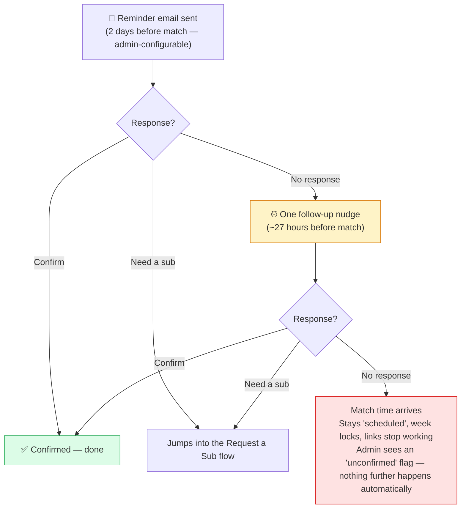
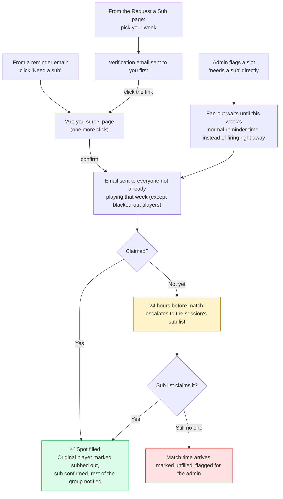
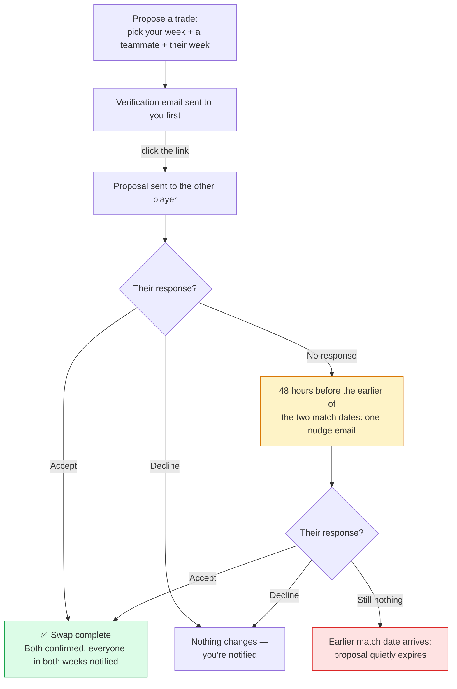
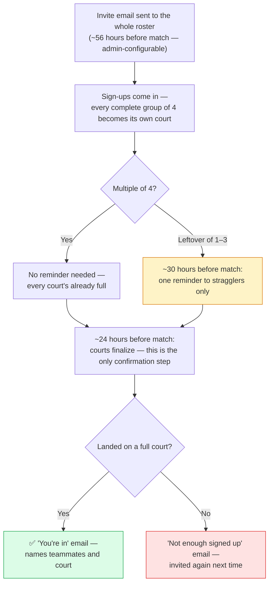

# Tennis & Pickleball Doubles Scheduler

A no-login website for a recurring doubles group — tennis, pickleball, or any
other doubles sport played on a fixed rotation: an automatic season scheduler
that balances playing time and partner variety, plus an email-driven
confirmation and substitution system. Built from `Full_Scope_Of_Work.md` and
`Technical_Architecture.md`.

This README covers what the app does and how to run it. For the full
walkthrough of a feature, the app documents itself better than any README
can: **`/help`** is the player-facing tour, **Admin → Guide** is the
admin-facing one — both are screenshot- and diagram-heavy, and both stay
current as the app changes. Treat this file as the map, not the territory.

## What it does

**For players** — no login, ever. Everyone gets a bookmarkable **My Page**
showing their schedule across every session they're in; self-service
**blackout dates**, **Request a Sub**, and **Swap a Week**; a full season
schedule, 4-week look-ahead, printable PDF, and subscribable calendar feed;
optional weather forecasts and a games-won leaderboard. Every action a player
can take is one click off an emailed link — see the screenshots below, or
`/help` for the full tour with every email mocked up.

**For admins** — everything above, plus the actual running of a season:
build a roster and the scheduler hits everyone's target exactly (or tells you
precisely why it can't); a two-tiered sub list; a Status page that flags
everything needing a human across every session; a full activity/email
audit trail; database backups; and support for multiple concurrent
sessions/clubs with automatic double-booking detection. This is the half of
the app a README can't really do justice to in prose — see the screenshots
below and **Admin → Guide** for the real depth.

## Screenshots

### The admin side

This is where running a season actually happens — and the part most worth
seeing before you commit to self-hosting it.

<table>
<tr>
<td width="50%">

**Dashboard, flagging a session that needs attention** — short-staffed weeks, unconfirmed players, an unfilled sub, overlapping enrollment, an actual double-booking. Nothing here means "all clear."


</td>
<td width="50%">

**A week's card, session detail page** — every player's status badge, Reassign / Resend link / Mark confirmed, plus ball duty and the week-level send buttons.


</td>
</tr>
<tr>
<td width="50%">

**Roster & target games** — check players onto a session and set targets; the page does the math live and tells you the moment it adds up.


</td>
<td width="50%">

**Players — Public name vs. Full name** — a short public form for player-facing pages, a full name for admin pages and emails only.


</td>
</tr>
<tr>
<td width="50%">

**Broader Sub List** — the whole pool of people willing to sub, install-wide; each session then picks its own subset.


</td>
<td width="50%">

**Session detail page** — every button for running a season week to week, one click away.


</td>
</tr>
</table>

### The player side

Covered in full, with every email mocked up, on the in-app `/help` page. A
sample:

<table>
<tr>
<td width="33%">

**My Page**


</td>
<td width="33%">

**Request a Sub**


</td>
<td width="33%">

**Full Season Schedule** (with weather)


</td>
</tr>
</table>

## Features

### Player-facing (all self-service, no login)

- **Season scheduler** — every player hits their target game count exactly, or the app explains precisely why not; partner pairings and ball duty spread out evenly. Runs multiple courts per week automatically (players-per-week just needs to be a multiple of 4).
- **My Page** (`/me`) — one bookmarkable dashboard per player, across every session they're in: upcoming matches, ball duty, one-click sub/swap, calendar link.
- **Blackout dates, Request a Sub, Swap a Week** — mark dates you can't play before the season's scheduled; after that, request a sub (opens to the whole roster) or propose a direct swap with one teammate. Every step that changes something needs a click-through from an emailed link, so nothing fires by accident.
- **Calendar, PDF, Player Stats, leaderboard** — a subscribable calendar feed that stays current automatically, a one-page printable schedule, a public target/played/ball-duty table, and games-won / win % leaderboards at three levels (session, admin-named season, and a resettable master board) with win % and games-per-match graphs.
- **Weather forecasts**, **dark mode**, **adjustable text size**, and a **mobile-friendly layout** — all self-service, all remembered per-browser.
- **Double-booking**, if a player's enrolled in two overlapping sessions, is caught and shown everywhere they'd look — schedule, My Page, PDF, calendar invite — weeks in advance, not just to the admin.

*Full walkthrough with every email mocked up: `/help` in the app.*

### Admin-facing (password-gated, `Admin → Guide` has the full walkthrough)

- **Roster & targets** — a live math check as you type; each player has a short **Public name** (shown to other players) and an optional **Full name** (admin pages and emails only).
- **Player-pair constraints** — "these two must never/always play the same week," checked for feasibility before it's silently ignored.
- **Two-tiered sub list** — an install-wide **Broader Sub List**, plus a per-session subset of who actually gets emailed when that session comes up short.
- **Status page & dashboard flags** — everything needing a human, across every session, in one place: short-staffed weeks, unfilled subs, stale swaps, double-bookings, paused reminders. A preview of what the reminder system will do over the next 7–30 days, so you can confirm it's actually running.
- **Multiple concurrent sessions** — different clubs, courts, or a first/second-half split, each with its own name/color/club shown in its own emails. Overlapping enrollment is flagged the moment a roster's saved; a real double-booking gets a one-click **Resolve conflicts…** suggestion tool.
- **Activity Log & Email Log** — a full audit trail of every admin action and every email the app has sent, for the inevitable "I never got that."
- **Manual controls** — Reassign, Mark confirmed, edit ball duty, a one-off **Send Email** (to a player, a roster, a week, or a test send of any template), and a **one-time sub (not on roster)** option for someone coordinated entirely outside the app.
- **Database backups** — one-click manual backup, automatic nightly cron, and off-site push over rsync/SSH — see "Backing up the database" below.
- **Weather forecasts**, per session — a checkbox and a lat/long pair; see `/admin/guide#weather-setup` for API key setup and troubleshooting.
- **Ad-hoc sessions** — a second session type for pickup games instead of a fairness-scheduled season: no targets, no blackout dates, first-come-first-served sign-ups that fill courts of 4.

*Full walkthrough, including exact email timing for every flow: **Admin → Guide** in the app.*

## How the self-service flows work

The diagrams below are the same timelines `/help` and `/admin/guide` walk through interactively — the whole shape of each flow, including what happens if nobody ever responds, without clicking through the site.

### Confirming a match



### Request a Sub



*An admin can close a sub request out at any point — reassigning the slot, marking the original player confirmed after all, or clearing the request entirely (which puts them back to "scheduled").*

### Swap a Week



### Ad-hoc pickup games



## What's here

```
src/
  db/            SQLite schema + connection (uses Node's built-in node:sqlite — no native build step)
  scheduler/     The scheduling engine (max-flow feasibility + partner-variety local search) and its tests
  services/      Email, ICS, PDF, cron, tokens, auth, timezone math, weather forecasts, sub/confirm business logic
  routes/        Express routes — public/ (no login) and admin/ (password-gated)
  views/         EJS templates
  public/        Static CSS
  scripts/       One-off CLI helpers (hashing the admin password)
```

## Installing from scratch

Starting from nothing but a machine with internet access:

1. **Get the code.** Clone the repo (skip this if you're already inside the folder):
   ```
   git clone https://github.com/kylekrieg/tennis-scheduler.git
   cd tennis-scheduler
   ```

2. **Install Node.js 22.5 or newer.** The app uses Node's built-in `node:sqlite` module, which requires it — there is no native module to compile, which is the whole point.
   ```
   node --version   # must be >= 22.5 — if not, install/upgrade Node first
   ```
   On a fresh machine without Node at all:
   ```
   curl -fsSL https://deb.nodesource.com/setup_22.x | sudo -E bash -
   sudo apt-get install -y nodejs
   ```

3. **Install dependencies.** From inside the `tennis-scheduler` folder:
   ```
   npm install
   ```
   This should finish in a few seconds — nothing here needs `node-gyp` or a C++ toolchain.

4. **Create your `.env` file** from the template:
   ```
   cp .env.example .env
   ```

5. **Generate an admin password hash** and paste it into `.env`:
   ```
   node src/scripts/hash-admin-password.js "choose-a-password"
   ```
   Copy the printed hash into `ADMIN_PASSWORD_HASH` in `.env`. This is only used to create the *first* admin account on the very first run — after that, admin accounts (including this one) live in the database and are managed from **Admin → Admins**, where you can add more people, each with their own username and password. `.env`'s `ADMIN_PASSWORD_HASH` is not read again after that first boot. That first account's username is auto-generated as `admin` (visible, and changeable, from **Admin → Admins** once you're logged in).

6. **Fill in the rest of `.env`:**
   - `SESSION_SECRET` — any long random string (e.g. `openssl rand -hex 32`).
   - `PUBLIC_SITE_URL` — `http://localhost:3000` for local use; the real domain once deployed (see below).
   - `GMAIL_USER` / `GMAIL_APP_PASSWORD` — optional for local testing. If left blank, emails are printed to the console instead of sent, which is enough to test every flow (confirm, sub request, escalation) without spamming anyone.

7. **Start the app:**
   ```
   npm start
   ```
   It creates `data/tennis.db` automatically on first run (SQLite, no separate database server needed) and starts the internal reminder/escalation check loop.

8. **Load it in a browser:**
   - `http://localhost:3000/admin` → log in with the password from step 5 → **New Session** to set up your roster, dates, match day/time, and per-player targets → **Schedule these players**.
   - `http://localhost:3000/schedule` to see the generated season.

   Or, to see it working immediately with sample data instead of setting up your own roster first:
   ```
   node src/db/seed-example.js
   ```
   This loads the example 9-player/17-week roster from the scope doc and generates its schedule, so `/schedule` and `/admin` have something to look at right away.

That's the whole local install. Everything past this point (pm2, Cloudflare Tunnel, a real domain) is only needed to make it reachable from outside your own machine — see **[RASPBERRY_PI_SETUP.md](RASPBERRY_PI_SETUP.md)**.

## Local development notes

- Without `GMAIL_USER`/`GMAIL_APP_PASSWORD` set, every email is logged to the console (and still recorded in the Email Log with status `logged_dev_mode`) instead of actually sent — the intended way to exercise the confirm/sub/escalation flows while developing.
- `node src/scheduler/engine.test.js` runs the scheduling engine's test suite directly (plain `assert` calls, no test framework) against the example roster, plus a few deliberately-infeasible cases to confirm conflicts are reported correctly.
- `data/` (the SQLite file) and `.env` are gitignored — don't commit either.

## Deploying to a Raspberry Pi

Full step-by-step instructions for taking this app from a fresh clone to running live on a Raspberry Pi — installing Node, copying the app over, running it under `pm2`, and exposing it publicly with a Cloudflare Tunnel — now live in their own guide: **[RASPBERRY_PI_SETUP.md](RASPBERRY_PI_SETUP.md)**.

## Backing up the database

Every player, blackout date, confirmation, sub, and email log entry lives in a single SQLite file (`data/tennis.db`). Backing up is just taking a safe, consistent copy of that file; restoring is putting one back.

**Manual backup** — either click **Backup now** on the **Admin → Backup** page (which also lists every existing backup with a Download button), or from the command line:
```
npm run backup
```
Both write a timestamped copy into `backups/` using SQLite's own `VACUUM INTO`, which is safe to run at any time — including while people are actively confirming or requesting subs — without pausing the app or risking a half-written copy.

**Automatic backup** — add a cron job on the Pi so this happens every night without thinking about it:
```
crontab -e
```
then add (swap `pi` for whatever user you're actually logged in as — run `whoami` if you're not sure; newer Raspberry Pi OS/Debian releases no longer create a default `pi` account and have you set your own username during first-boot setup instead):
```
0 2 * * * cd /home/pi/tennis-scheduler && /usr/bin/node src/scripts/backup-db.js >> backup.log 2>&1 && /usr/bin/node src/scripts/backup-offsite.js >> backup.log 2>&1
```
That runs a backup every night at 2am, automatically prunes anything beyond the most recent 30 (about a month at one a day), then pushes the whole `backups/` folder to another machine — see the next section. If you haven't set up off-site push yet, drop the second `&&` clause; `backup-db.js` alone is still safe to run on its own, it just leaves everything sitting on the Pi's own SD card.

**Get backups off the Pi, automatically.** A backup sitting in `backups/` on the same SD card doesn't protect you if the Pi itself dies — that's the actual scenario to plan for. `npm run backup:offsite` (`src/scripts/backup-offsite.js`) pushes the whole `backups/` folder to another machine over `rsync` + SSH, so it only transfers what's new or changed each run — cheap even as the folder accumulates a month of nightly snapshots. This walks through setting it up from scratch, including the couple of SSH gotchas that aren't obvious the first time — useful whether you're running on a Raspberry Pi (the primary target here) or anywhere else this gets deployed.

**What you need:** a second machine reachable over SSH — another computer on your network, a NAS, or a cheap VPS. It needs an SSH server running and `rsync` installed (most Linux/macOS machines already have both; on Debian/Ubuntu, `sudo apt install openssh-server rsync` if not). The app's own machine needs `rsync` too — already there on Raspberry Pi OS by default; `sudo apt install rsync` if not.

1. **Generate a dedicated SSH key** on the machine running the app — don't reuse a personal key, so this one can be revoked independently if it's ever compromised:
   ```
   ssh-keygen -t ed25519 -f ~/.ssh/tennis_backup -N ""
   ```
   The `-N ""` gives it an empty passphrase, since this key has to work unattended from cron with nobody around to type one in.

2. **Copy the public key to the destination machine**, so the app server can log in without a password:
   ```
   ssh-copy-id -i ~/.ssh/tennis_backup.pub you@your-other-machine
   ```
   This asks for the destination account's password once, then installs the key so future logins don't need it. Make sure the destination folder you're syncing into (e.g. `/home/you/tennis-backups`) already exists on that machine first — `rsync` won't create it for you.

3. **Accept the destination's host key before automating anything.** The very first SSH connection to a new host prompts "Are you sure you want to continue connecting (yes/no)?" — an interactive prompt that will silently hang or fail if it's hit for the first time inside an unattended cron job. Get it out of the way by hand:
   ```
   ssh -i ~/.ssh/tennis_backup you@your-other-machine echo ok
   ```
   Type `yes` if asked; it should then print `ok`. If it prints `ok` straight away with no prompt, it's already accepted and you're set.

4. **Add the connection details to `.env`** (see `.env.example` for the full list):
   ```
   OFFSITE_SSH_HOST=your-other-machine.local
   OFFSITE_SSH_USER=you
   OFFSITE_SSH_PATH=/home/you/tennis-backups
   OFFSITE_SSH_KEY=/home/pi/.ssh/tennis_backup   # again, swap "pi" for your actual username if different
   ```
   `OFFSITE_SSH_HOST` can be a hostname, a `.local` mDNS name (if both machines are on the same network), or a plain IP address. If the destination uses a non-default SSH port, set `OFFSITE_SSH_PORT` too (defaults to 22).

5. **Test it by hand first:** `npm run backup:offsite`. It should exit quietly with no output — check the destination folder for the pushed `.db` files. If something's wrong, running it this way surfaces the actual `rsync`/`ssh` error directly instead of it being buried in a cron log line (see Troubleshooting below).

6. **Add the cron line above** (or add `&& npm run backup:offsite` to whatever line you already have).

Once this is set up, Admin → Backup also gets a **Push off-site now** button for an on-demand push (e.g. right after you finalize a season's roster), using the exact same underlying code as the cron job. If `OFFSITE_SSH_HOST`/`USER`/`PATH` are left blank, the script exits cleanly with a one-line "not configured" note rather than failing the cron job — the local backup has already succeeded by the time it runs either way.

**Troubleshooting:**
- **"Permission denied (publickey)"** — the public key isn't actually installed on the destination, or `OFFSITE_SSH_KEY` in `.env` points at the wrong private key file. Re-run `ssh-copy-id` and double-check the path.
- **"Host key verification failed"** — step 3 above was skipped, or the destination's host key changed (e.g. it was reinstalled or re-imaged). Remove the stale entry for that host from `~/.ssh/known_hosts` on the app's machine and reconnect once by hand to re-accept it.
- **Connection just hangs or times out** — the destination isn't reachable on port 22 (or your custom `OFFSITE_SSH_PORT`) from wherever the app is running. Check the destination's firewall, and if it's behind a router or cloud provider, that the port is actually forwarded/open.
- **"rsync: command not found"** — install `rsync` on whichever side is missing it (the app's machine, the destination, or both).
- **Destination path doesn't exist** — `rsync` won't create `OFFSITE_SSH_PATH`'s directory for you; create it by hand on the destination first (`mkdir -p /home/you/tennis-backups`).

If you'd rather push to cloud storage (Google Drive, Dropbox, Backblaze B2, S3, etc.) instead of a second machine, `src/services/offsiteBackup.js`'s `pushBackupsOffsite()` is a small, self-contained function — swap its `rsync`/`ssh` call for an `rclone sync backups/ remote:path` call and everything else (the cron wiring, the admin button, the "not configured" fallback) keeps working unchanged.

**Restoring a backup** (database corrupted, but the Pi itself is fine):
1. Stop the app: `pm2 stop tennis-scheduler`
2. Copy the backup file into place as `data/tennis.db`, overwriting whatever's there: `cp tennis-backup-20260806-020000123.db data/tennis.db`. Delete `data/tennis.db-wal` and `data/tennis.db-shm` if either exists, so nothing stale from the old database lingers.
3. Restart: `pm2 start tennis-scheduler`
4. Check `/admin` loads and the roster/sessions look right.

**Restoring after the Pi itself is gone** (SD card died, Pi was lost/stolen, starting over on new hardware): the `.db` backup covers every player, session, schedule, and log entry — but **not** `.env`, which never leaves the Pi's own disk and isn't part of any backup. Recovery is two separate things, not one:

1. Set up a fresh Pi per [RASPBERRY_PI_SETUP.md](RASPBERRY_PI_SETUP.md): clone from GitHub, `npm install`, `cp .env.example .env`.
2. Fill in the new `.env` — most of it doesn't need to match the old one exactly:
   - `ADMIN_PASSWORD_HASH` — put anything valid here (`node src/scripts/hash-admin-password.js "temp-password"`). It's only read to seed an admin row into an *empty* database; once you drop in a real `.db` backup (next step), the `admins` table already has your real logins in it and this value is never read again.
   - `SESSION_SECRET` — any new long random string is fine. It doesn't need to match the old one; the only effect of changing it is that anyone currently logged in gets signed out once.
   - `GMAIL_USER` / `GMAIL_APP_PASSWORD` — these genuinely can't be recovered from a backup, since Google never lets you re-view an app password. Sign into the Gmail account and generate a fresh app password (Google Account → Security → App passwords), same as the very first setup.
   - `PUBLIC_SITE_URL`, `PORT`, `SQLITE_PATH`, `BACKUP_DIR`, `OFFSITE_SSH_*` — plain config, not secrets; set them back to what they were (or just re-derive from how the tunnel/domain is set up) if you remember them, or leave the safe defaults and adjust later.
3. Before starting the app for the first time, copy your most recent `.db` backup into place as `data/tennis.db` — same swap-in step as the section above, done *before* `pm2 start`/`npm start` runs so the app never gets a chance to create and seed a brand-new empty database first.
4. Start the app, confirm `/admin` loads with your real logins and roster, and send yourself a test email (Admin → Send Email) to confirm the new Gmail app password actually works.

Worth remembering: this is exactly why off-site push matters more than it might seem — a backup that only exists on the same SD card as everything else doesn't help if that SD card is what died.

## Starting fresh with a clean database

If you've been testing with dummy/example data (e.g. `npm run seed:example`) and want to clear it out before switching to your real roster, don't delete `data/tennis.db` by hand — that also wipes your admin login. Instead:
```
npm run reset-data -- --confirm
```
This deletes every player, session, schedule, blackout date, sub request, and email log entry, but **keeps your admin logins and settings (timezone) intact**, so you're not locked out afterward. It takes an automatic backup first (into `backups/`, same as `npm run backup`) in case you want anything back later. Running `npm run reset-data` without `--confirm` just prints what it would do and exits without touching anything — the `--` before `--confirm` is required so npm passes the flag through to the script instead of trying to parse it itself.

After it finishes: add your real players from Admin → Players, then set up a session from Admin → New session.

## Key implementation notes

- **Database**: uses Node's built-in `node:sqlite` (stable enough as of Node 22.5+), not `better-sqlite3` — this means `npm install` never needs to compile a native module, which matters most on a Raspberry Pi where native builds are the #1 source of deployment pain. Schema changes to existing tables go through a small migration guard in `src/db/index.js` so upgrading doesn't wipe existing data.
- **Scheduling engine** (`src/scheduler/engine.js`): computes which players play each week via max-flow (guarantees a feasible answer exists, or proves it doesn't and reports exactly why), then runs a bounded simulated-annealing pass to spread partner pairings evenly, then assigns ball duty proportional to each player's target share.
- **Tokens**: `crypto.randomBytes(32)`, only a SHA-256 hash is stored in the DB, GET never mutates state (only renders), POST is the only thing that changes anything — including the self-service "Request a Sub" page, which mints a token and hands off into the exact same flow as an emailed link.
- **Timezone-aware scheduling**: match time, reminder time, and the escalation deadline are all computed against the timezone set in Admin → Settings using proper wall-clock conversion (`src/services/tz.js`), not raw UTC math — this matters for anyone not on UTC.
- **The four open items** from `Full_Scope_Of_Work.md` §10 were resolved (with sign-off) as: a confirmed player can request a sub at any time (no cutoff); an admin reassigning someone onto their own blackout date is warned but allowed; two simultaneous sub requests in the same week are not auto-handled in v1 (the second is routed to the admin to sort out manually); overlapping sessions are allowed.
