# Tennis Doubles Scheduler

A no-login website for a recurring doubles tennis group: an automatic season
scheduler that balances playing time and partner variety, plus an
email-driven confirmation and substitution system. Built from
`Full_Scope_Of_Work.md` and `Technical_Architecture.md`.

## Features

- **Season scheduler** — given a roster, per-player target game counts, and blackout dates, computes who plays each week and who's on ball duty, guaranteeing every player hits their target exactly (or explains precisely why it can't). Supports running more than one court at once — set "Players per week" to a multiple of 4 (8 for 2 courts, 12 for 3, and so on) on the session's Edit page; the schedule and PDF automatically add a Court column once a session uses more than one. If blackout dates leave a week without enough available players to fill it, that week alone is scheduled with whoever's available (capped to a full court, never a partial one) and flagged for attention — it doesn't block the rest of the season from scheduling, and nobody else's target is auto-adjusted to compensate; the Stats page shows exactly who ended up short of their target and by how much. Each week's card has an "Add a player…" control for manually topping off a short-staffed week (or any week) beyond what Reassign alone can do, since Reassign only swaps an existing assignment rather than adding a new one. A related but different problem — a specific player's *own* blackout dates leaving them personally unable to ever reach their target, even though every week they miss is otherwise fully staffed — is handled differently: rather than failing the whole run, the shortfall is automatically shifted onto another player with room (lowest-target players first), and exactly what got adjusted and why is reported in the scheduling result and visible afterward on the Stats page. Configured targets in the database are never changed by this — only that particular run's actual game counts differ from what was configured, in case it needs to be corrected by hand on a future re-schedule.
- **"How It Works"** (`/help`) — a single skimmable page, first link in the nav, that walks a new player through every self-service feature in a few minutes: confirming a match, blackout dates, Request a Sub, Swap a Week, My Page, the schedule/look-ahead pages, calendar, PDF, what "double booked" means, and a glossary of every status badge — with a jump-link table of contents at the top and a link to the real page for each topic, so nobody needs someone else to explain where things are. The admin panel has its own equivalent, **Admin → Guide**, walking through the whole process from the admin's side (create a session, build the roster, collect blackout dates, schedule, run it week to week, keep an eye on things) — not visible to players since it lives inside the password-gated admin section.
- **Player-facing pages, no login required**: full season schedule, 4-week look-ahead, blackout date submission, single-page PDF of the whole season, and a **Request a Sub** page so a player who already knows they'll miss a match weeks out doesn't have to wait for the reminder email.
- **"My Page"** (`/me`) — a bookmarkable, per-player dashboard: upcoming matches and status across every session they're in, ball duty weeks, one-click "Need a sub," a callout for any session still awaiting their blackout dates, and their calendar-subscribe link, all in one place instead of switching sessions on each separate page. Reachable from the nav bar, or automatically linked from the confirm/need-sub/claim-sub result pages.
- **Direct player-to-player swaps** (`/swap`) — trade one of your upcoming weeks for another specific player's, instead of requesting a sub and fanning out to the whole roster. Both players keep playing the same number of games, just on different dates — neither counts as a sub. The other player has to accept via an emailed link before anything changes. If nobody's responded once it's within 48 hours of whichever of the two weeks comes first, the target player gets a one-time reminder email; if it's still unanswered once that same deadline actually arrives, the request quietly expires (the trade can't happen anymore either way) rather than sitting "pending" forever and blocking either assignment from being part of some other swap later. A still-unanswered, already-nudged swap shows up on the dashboard and Status page so it doesn't just go silent. If an accepted swap happens to land a player on a date they're already playing in a different session, it's not blocked — it's flagged on the session detail page, dashboard, and Status page for the admin to sort out (see "Double-booked" below). Every swap, and every email it sends, is recorded — proposals and responses show up in the Activity Log (tagged as the player's own action, not an admin's), and the emails themselves in the Email Log, same as everything else in the app.
- **Personal calendar, two ways**: a one-time `.ics` download for the currently-selected season, or a subscribable feed (`/calendar/feed/<player>.ics`, with a one-click `webcal://` Subscribe button and a copyable URL for "Add calendar → From URL") that covers every session a player's currently enrolled in and stays up to date automatically as re-schedules and subs happen — no re-downloading needed. Your calendar app controls its own refresh interval; this app doesn't push updates.
- **Blackout dates, self-service and locked once scheduled**: a player picks their name, checks the dates they can't play, and saves — takes effect immediately, no confirmation email or second click required. Once the admin clicks "Schedule these players," blackout dates for that session are locked and can no longer be changed from the player-facing page — a player who needs to miss a week after that point uses **Request a Sub** instead. Admins can still edit any player's blackout dates directly at any time from Admin → session → Blackout Dates, which bypasses the lock entirely. While a session is still in draft (before you've clicked "Schedule these players"), that same page has a **Notify roster** button that emails everyone currently enrolled a direct link to go enter their blackout dates — nothing does this automatically, so use this once the roster's set and you're ready for players to start submitting. Each player's link has their own name pre-selected on arrival, so following it and hitting Save can't land on the wrong person (manually switching the dropdown first still can, since there's no separate confirmation step anymore). It also shows a summary table of every blackout date on record for the session, grouped by player, so there's no need to click through each player one at a time to see the full picture. On the session detail page, each week also shows who's blacked out for that match right under the week header — useful context before manually reassigning someone. If a player is enrolled in more than one session and a date they've already blacked out in one happens to also be a match date in another, it automatically carries over — no need to enter it twice. It shows up on the other session's blackout page (both the admin and self-service versions) as an already-checked, greyed-out entry naming where it came from, and the scheduler treats it as a real blackout there too, not just a display note.
- **Email-driven confirm / substitute flow**: reminder emails with links, an "are you sure?" step before a sub request fans out to the rest of the roster, first-click-wins substitute claiming, automatic escalation to a sub list if nobody responds in time, and a morning-of follow-up nudge for anyone who's stayed silent. The sub list itself is two-tiered: **Admin → Broader Sub List** manages the whole pool of people willing to sub across the entire install, and each session's own **Manage subs** page (linked from its detail page) picks which subset of that pool actually gets emailed when *that* session's requests go unanswered — a sub who only plays Tuesdays doesn't need to hear about a Thursday session's empty slot. Every email body renders at a comfortable, explicit font size (17px) rather than relying on the recipient's mail client's own small default for unstyled text. Both the original reminder's link and the follow-up nudge's link stay valid at the same time — going back to an older email won't hit a dead link. A link stops working the moment its player requests a sub for that slot, or once the match's start time has passed. Every one of these emails has the match time and court/location right in the subject line (e.g. `Tennis Tuesday, Aug 25, 6:00 PM, Court 3 — please confirm`), pulled from that session's Edit page — no need to open the email to see when or where. A **Send automatic reminders** checkbox on the session's Edit page pauses the automatic reminder/follow-up emails for that session entirely (handy while testing a season before real players are on it) — manual sends, the per-player **Resend link** button and the per-week **Send reminders now** button, both still work regardless, so you can trigger things by hand while it's off. A session with reminders paused shows a badge on its detail page and a flag on the dashboard, so it's hard to forget one was left off.
- **Admin panel** (password-gated, supports multiple admins each with their own password — manage them under Admin → Admins): session setup with a live roster/target-math helper, one-click re-scheduling (tucked onto the Edit session page so it's not a stray click away from routine week-to-week actions), manual reassignment and ball-duty edits (reassigning, or manually confirming, a player who currently has an open sub request automatically closes that request out and kills its still-outstanding invite links, so a lingering email can't undo the admin's fix; there's also a standalone "Clear sub request" button next to the sub-status flag for clearing it directly, without reassigning anyone), a full stats view (targets vs. actual, ball duty totals, partner matrix, sub history), an Email Log with delivery status for every message the app has sent, a manual "Send reminders now" per week, a `(reminded)` tag next to each still-scheduled player showing whether their reminder (and follow-up) email has actually gone out, a **Send Email** page for a one-off custom message to either a single player or a whole session's active roster at once, and the ability to permanently delete a session (with confirmation) from its Edit page — players are never deleted along with it, since a player can belong to more than one session. Forms across the admin panel (session dates/times, players, sub list, ball duty, reassign) validate input server-side and reject blanks/bad values with a plain error message instead of crashing or silently saving garbage data.
- **Status page** (Admin → Status) — one place with everything that needs a human across every session (scheduling conflicts, short-staffed weeks, unfilled sub requests, unconfirmed players, missing ball duty, paused reminders), plus a preview of what the reminder system is about to do on its own over the next 7/14/21/30 days — which week's reminder goes out when and to whom, follow-up nudges, sub-request escalations, and week locks — so you can confirm it's actually working without waiting for match day. Anything that should have already happened but hasn't is marked overdue, a real signal the background process has stopped running.
- **Archiving a session** hides it from the dashboard and every player-facing page (schedule, lookahead, calendar, PDF, blackout dates, request-a-sub) without deleting anything — a season that's over just gets in the way otherwise. Archived sessions land in a collapsed "Archived sessions" section at the bottom of the dashboard, where a click un-hides them again; direct links (stats, edit, etc.) keep working the whole time. Archiving also silences all further reminder/follow-up/escalation emails for that session, in case there's still an unresolved week or sub request when you archive it.
- **Multiple concurrent sessions** are supported — the same install can run more than one group/season at once, each with its own club name and court/location shown in that session's emails (set per session on its Edit page, not shared globally), which matters if the same install is ever used for different clubs or venues. Every player-facing page (schedule, look-ahead, PDF, calendar, blackout dates, request-a-sub, swap) shows the session as "Session name — Club, Court" rather than the bare admin-internal name, so two same-day sessions at the same club (e.g. Court 2 vs. Court 4) are never ambiguous to a player deciding which one they're looking at — admin-only pages keep showing the plain name, since that's the label that makes sense there. Match-day and swap/blackout email subject lines include the time and court for the same reason. Each session also gets an optional **Color** (set on its Edit page, or auto-assigned if you leave it blank) — a colored dot and banner show that session's identity at the top of every player-facing page ("You're viewing: ● Session A — Court 2"), the session switcher when a player's viewing more than one, and a colored banner at the top of every match-related email, so telling two same-club, same-time sessions apart doesn't rely on reading fine print. If a player is enrolled in two sessions that meet on the same day of week with overlapping dates, that's flagged up front as a risk (dashboard, Status page, and a card on each session's detail page) the moment the roster is saved. You can set a **Priority** for that player on each session's roster (lower number wins) as a note for whoever ends up resolving a real conflict by hand — but priority is advisory only; the scheduler doesn't use it to auto-exclude anyone, so it's entirely possible (and expected) for both sessions to end up scheduling the same player on the same date anyway.
- **Actual double-booking is caught and shown everywhere a player looks, weeks in advance** — not just to the admin. If a player really does end up assigned to play in two different sessions on the same date, it shows up as a red "double booked" badge (in place of their usual status badge) on that session's full schedule and 4-week look-ahead, on their own bookmarked My Page, on the **Request a Sub** and **Swap a Week** pages when picking which of their own weeks to act on, as a `[DB]` marker on the printable PDF, and as a `DOUBLE BOOKED —` prefix on the calendar invite itself (both the one-time download and the subscribable feed) — so a player finds out from the same page/email/calendar entry they'd normally check anyway, not by having to be told separately. It's also visible to the admin: a summary card on the session detail page, a dashboard/Status page flag, and — right at the specific player row inside each week's card — the same red "double booked" badge in place of "scheduled," so it's obvious scrolling week by week, not just at the top of the page. The player is expected to resolve it themselves the normal way: reassign out of one of the two (if there's someone to swap with) or request a sub through the existing self-service flow.
- **Admin activity log** (Admin → Activity Log) — a plain-English history of admin-triggered changes (who scheduled a season, reassigned a slot, edited a player, changed a setting, and so on), since every admin shares full, untiered access. Filterable by session, action, admin, and free-text search. Manual/automatic email sends aren't duplicated here since they're already fully tracked in the Email Log.
- **Database backups**: one-click manual backup with browser download from Admin → Backup, a `npm run backup` CLI command for cron, and automatic pruning of old backups — see "Backing up the database" below.
- **Dark mode**: a toggle in the top-right of every page (public and admin) switches the whole site between light and dark. It remembers your choice per-browser and otherwise follows your system's light/dark setting the first time you visit.
- **Ad-hoc sessions** — a second session type (choose it once, at creation) for recurring pickup games instead of a fairness-scheduled season: no roster targets, no blackout dates, no confirm/need-a-sub flow. An invite email goes out to the roster a configurable number of hours before each match (56h by default); courts fill first-come-first-served as players click "I'm in" — 4 signs in a court immediately, no waiting for a deadline. If sign-ups aren't a clean multiple of 4, a reminder goes to stragglers (30h default); a final email announces the courts (24h default), and anyone left in an incomplete group is told it didn't fill this time. Once a court forms it shows up on the player's normal schedule, My Page, calendar, and PDF like any other match — just with no sub/swap actions on it.

## Screenshots

A few of the player-facing pages, and the admin dashboard:

<table>
<tr>
<td width="50%">

**Next 4 Weeks** — every upcoming date, teams, and ball duty at a glance
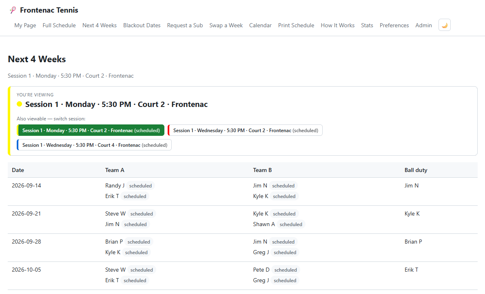

</td>
<td width="50%">

**My Page** — a bookmarkable dashboard across every session you're in
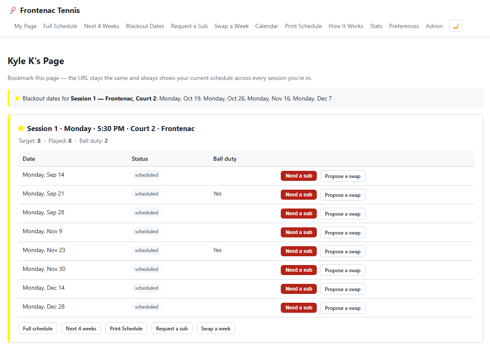

</td>
</tr>
<tr>
<td width="50%">

**Request a Sub** — no login, pick your name, pick the week
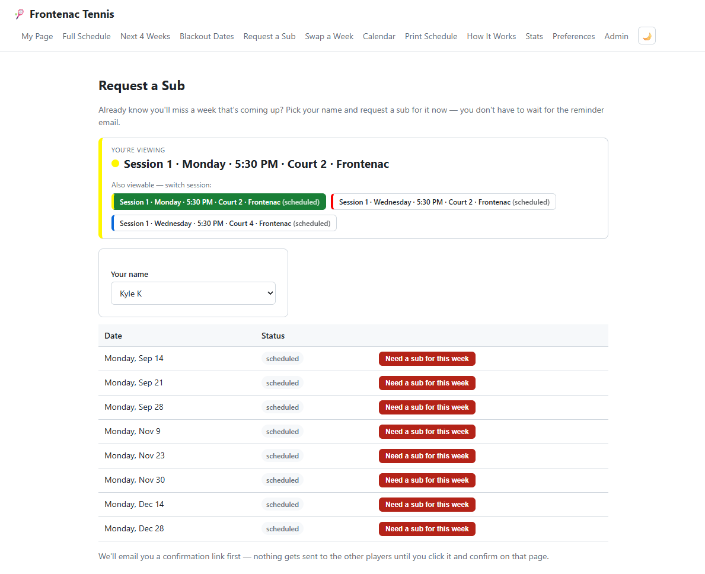

</td>
<td width="50%">

**Swap a Week** — trade a week with a specific teammate instead
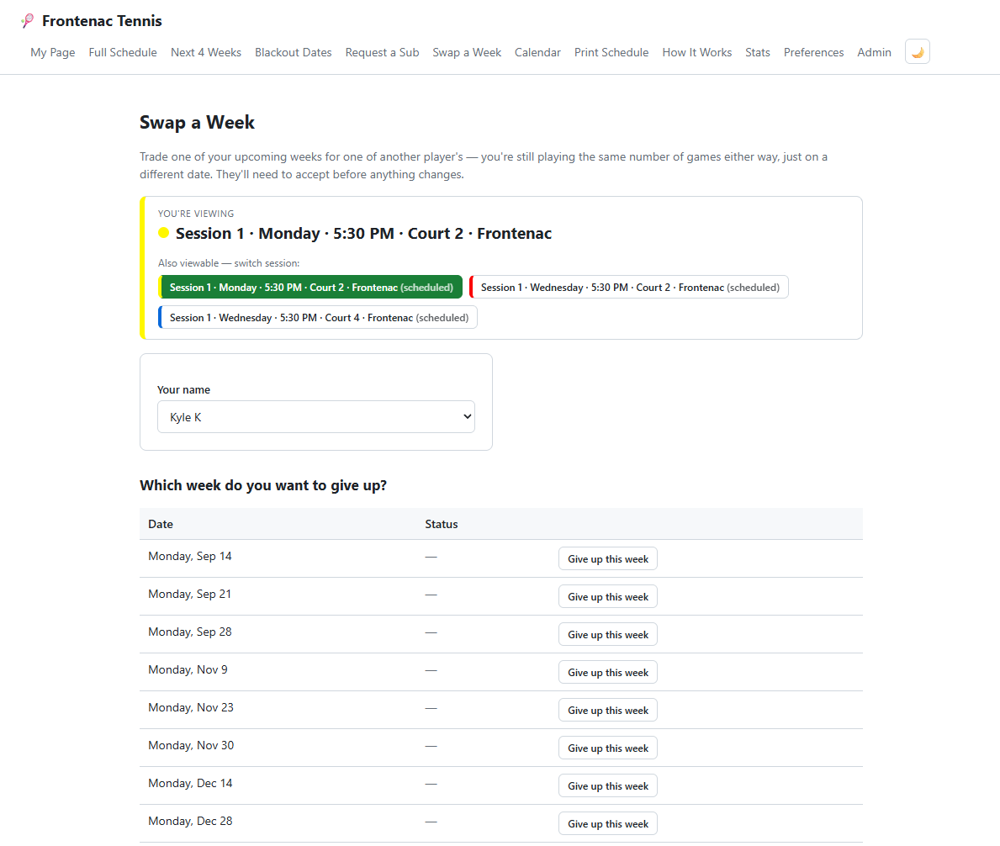

</td>
</tr>
<tr>
<td width="50%">

**Blackout Dates** — self-service, carries over automatically between sessions on the same date
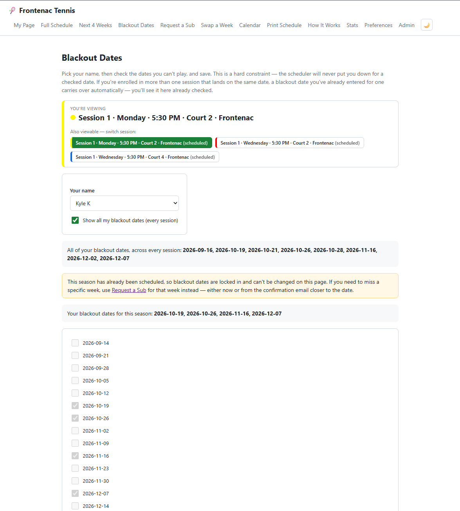

</td>
<td width="50%">

**Personal Calendar** — one-time download or a standing subscription that stays current
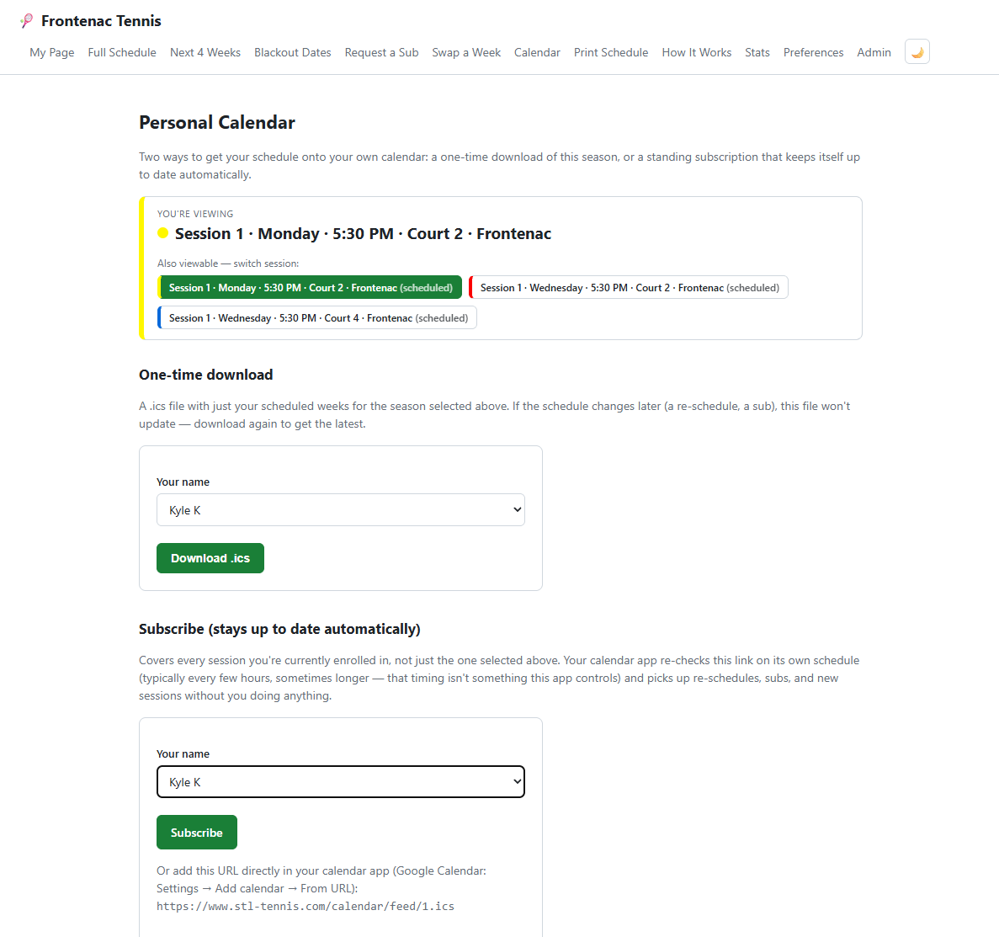

</td>
</tr>
<tr>
<td width="50%">

**Admin Dashboard** — every session's status, flags, and conflicts in one place
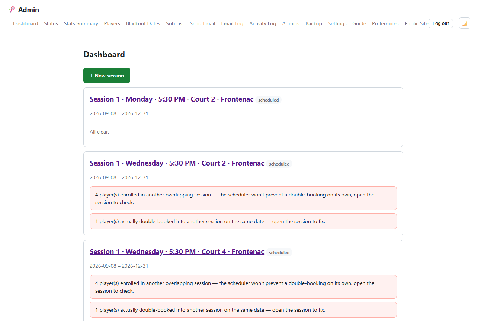

</td>
<td width="50%"></td>
</tr>
</table>

## How the self-service flows work

The player-facing `/help` page walks through each of these interactively; the diagrams below are the same timelines, so you can see the whole shape of each flow — including what happens if nobody ever responds — without clicking through the site.

### Confirming a match

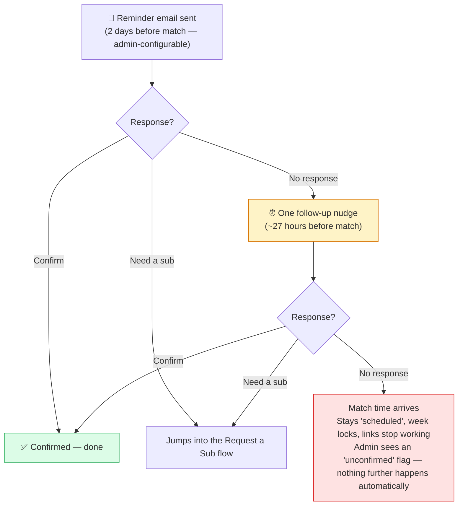

### Request a Sub

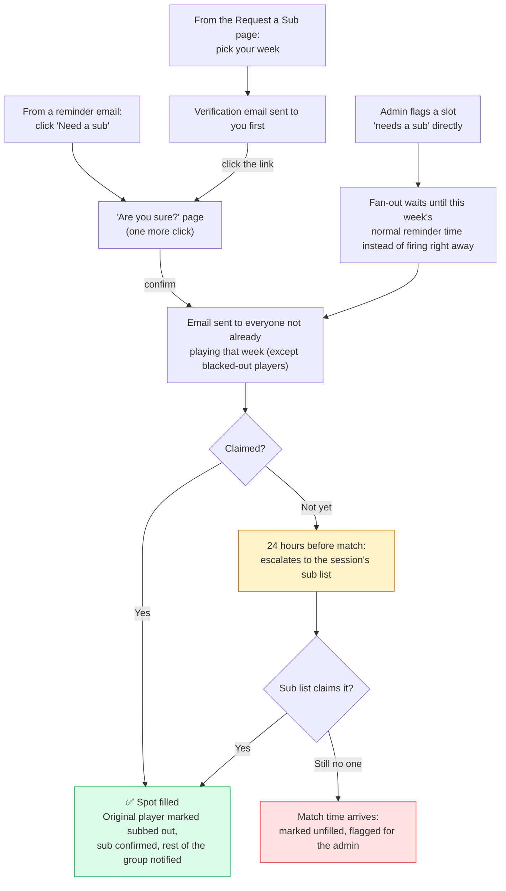

*An admin can close a sub request out at any point — reassigning the slot, marking the original player confirmed after all, or clearing the request entirely (which puts them back to "scheduled").*

### Swap a Week

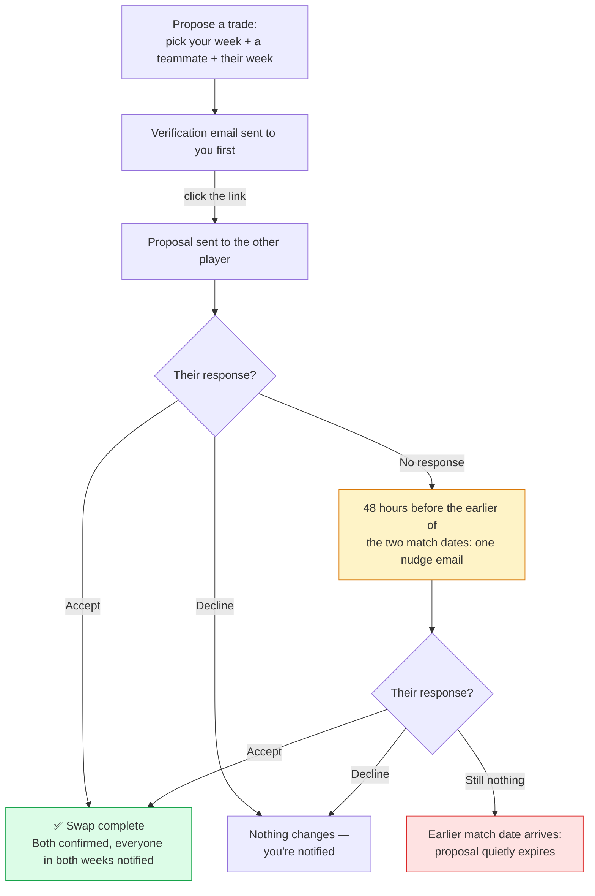

### Ad-hoc pickup games

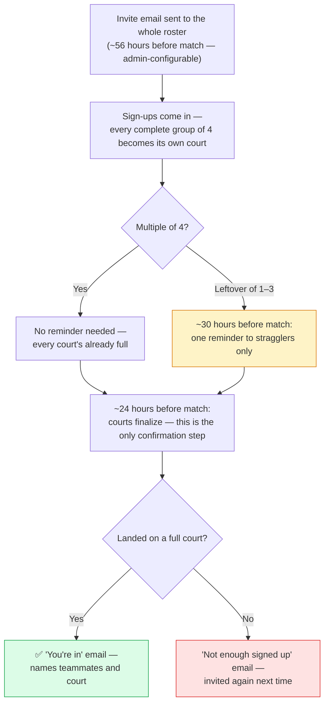

## What's here

```
src/
  db/            SQLite schema + connection (uses Node's built-in node:sqlite — no native build step)
  scheduler/     The scheduling engine (max-flow feasibility + partner-variety local search) and its tests
  services/      Email, ICS, PDF, cron, tokens, auth, timezone math, sub/confirm business logic
  routes/        Express routes — public/ (no login) and admin/ (password-gated)
  views/         EJS templates
  public/        Static CSS
  scripts/       One-off CLI helpers (hashing the admin password)
```

## Installing from scratch

Starting from nothing but this folder (or a fresh clone) and a machine with internet access:

1. **Install Node.js 22.5 or newer.** The app uses Node's built-in `node:sqlite` module, which requires it — there is no native module to compile, which is the whole point.
   ```
   node --version   # must be >= 22.5 — if not, install/upgrade Node first
   ```
   On a fresh machine without Node at all:
   ```
   curl -fsSL https://deb.nodesource.com/setup_22.x | sudo -E bash -
   sudo apt-get install -y nodejs
   ```

2. **Install dependencies.** From inside the `tennis-scheduler` folder:
   ```
   npm install
   ```
   This should finish in a few seconds — nothing here needs `node-gyp` or a C++ toolchain.

3. **Create your `.env` file** from the template:
   ```
   cp .env.example .env
   ```

4. **Generate an admin password hash** and paste it into `.env`:
   ```
   node src/scripts/hash-admin-password.js "choose-a-password"
   ```
   Copy the printed hash into `ADMIN_PASSWORD_HASH` in `.env`. This is only used to create the *first* admin account on the very first run — after that, admin accounts (including this one) live in the database and are managed from **Admin → Admins**, where you can add more people, each with their own username and password. `.env`'s `ADMIN_PASSWORD_HASH` is not read again after that first boot. That first account's username is auto-generated as `admin` (visible, and changeable, from **Admin → Admins** once you're logged in).

5. **Fill in the rest of `.env`:**
   - `SESSION_SECRET` — any long random string (e.g. `openssl rand -hex 32`).
   - `PUBLIC_SITE_URL` — `http://localhost:3000` for local use; the real domain once deployed (see below).
   - `GMAIL_USER` / `GMAIL_APP_PASSWORD` — optional for local testing. If left blank, emails are printed to the console instead of sent, which is enough to test every flow (confirm, sub request, escalation) without spamming anyone.

6. **Start the app:**
   ```
   npm start
   ```
   It creates `data/tennis.db` automatically on first run (SQLite, no separate database server needed) and starts the internal reminder/escalation check loop.

7. **Load it in a browser:**
   - `http://localhost:3000/admin` → log in with the password from step 4 → **New Session** to set up your roster, dates, match day/time, and per-player targets → **Schedule these players**.
   - `http://localhost:3000/schedule` to see the generated season.

   Or, to see it working immediately with sample data instead of setting up your own roster first:
   ```
   node src/db/seed-example.js
   ```
   This loads the example 9-player/17-week roster from the scope doc and generates its schedule, so `/schedule` and `/admin` have something to look at right away.

That's the whole local install. Everything past this point (pm2, Cloudflare Tunnel, a real domain) is only needed to make it reachable from outside your own machine — see **Deploying to a Raspberry Pi** below.

## Local development notes

- Without `GMAIL_USER`/`GMAIL_APP_PASSWORD` set, every email is logged to the console (and still recorded in the Email Log with status `logged_dev_mode`) instead of actually sent — the intended way to exercise the confirm/sub/escalation flows while developing.
- `node src/scheduler/engine.test.js` runs the scheduling engine's test suite directly (plain `assert` calls, no test framework) against the example roster, plus a few deliberately-infeasible cases to confirm conflicts are reported correctly.
- `data/` (the SQLite file) and `.env` are gitignored — don't commit either.

## Deploying to a Raspberry Pi

1. **Install Node.js LTS** (Node 22 or newer — required for `node:sqlite`):
   ```
   curl -fsSL https://deb.nodesource.com/setup_22.x | sudo -E bash -
   sudo apt-get install -y nodejs
   node --version   # confirm >= 22.5
   ```

2. **Copy the app onto the Pi** (git clone, scp, whatever's easiest) and install dependencies:
   ```
   cd tennis-scheduler
   npm install
   ```
   This should complete in seconds — there's nothing to compile.

3. **Create `.env`** from the example and fill in the real values (same as steps 3–5 above), plus:
   - `PUBLIC_SITE_URL` — the domain you'll set up in step 5 below, e.g. `https://tennis.yourdomain.com`.
   - `GMAIL_USER` / `GMAIL_APP_PASSWORD` — a real Gmail account and an [app password](https://myaccount.google.com/apppasswords) (not your normal Gmail password) — required this time, since this is the real deployment.

4. **Install pm2 and run the app under it** so it survives reboots and restarts if it crashes:
   ```
   sudo npm install -g pm2
   pm2 start src/server.js --name tennis-scheduler
   pm2 save
   pm2 startup     # follow the printed instructions (runs a sudo command once)
   ```

5. **Expose it publicly with a Cloudflare Tunnel** (no port forwarding needed):
   ```
   curl -L https://github.com/cloudflare/cloudflared/releases/latest/download/cloudflared-linux-arm64.deb -o cloudflared.deb
   sudo dpkg -i cloudflared.deb
   cloudflared tunnel login
   cloudflared tunnel create tennis-scheduler
   cloudflared tunnel route dns tennis-scheduler tennis.yourdomain.com
   cloudflared tunnel run tennis-scheduler --url http://localhost:3000
   ```
   Run `cloudflared` under pm2 too (`pm2 start cloudflared -- tunnel run tennis-scheduler --url http://localhost:3000`) so the tunnel survives reboots, then `pm2 save` again.

6. **Verify:**
   - Load `https://tennis.yourdomain.com/schedule` from outside your home network.
   - Log into `/admin` with username `admin` and the password you hashed earlier.
   - Create a session, add the roster with target games, save, click **Schedule these players**, and confirm the season fills in.
   - Use **Send Email** in the admin panel to send yourself a test email end-to-end and confirm it lands in your inbox.
   - Check **Admin → Email Log** afterward and confirm that test email shows status `sent`, not `logged_dev_mode` — if it still says `logged_dev_mode`, `GMAIL_USER`/`GMAIL_APP_PASSWORD` aren't being picked up.

### Notes on reliability

- The reminder/follow-up/escalation logic runs as an internal check-loop (every 60s) inside the same Node process, not a fixed cron string — it asks "should this have gone out by now?" rather than "is it exactly this minute?", so if the Pi reboots or loses power overnight, anything that should have been sent already goes out as soon as the process is back up.
- That same check-loop automatically locks each week once its scheduled match time has passed. Locked weeks are read-only in the admin panel (no reassign/resend/mark-confirmed/ball-duty edits — they just show what happened) and are always skipped when you click "Schedule these players" again, so a mid-season roster change never touches a match that's already been played.
- Gmail SMTP doesn't reliably surface bounces. A typo'd player email will silently fail to deliver — the admin dashboard's "unconfirmed" flag and the Email Log are the indirect signals to watch for that.
- `pm2 logs tennis-scheduler` is the fastest way to see what the app is doing (including the console-logged email previews if SMTP isn't configured yet).

## Backing up the database

Every player, blackout date, confirmation, sub, and email log entry lives in a single SQLite file (`data/tennis.db`). Backing up is just taking a safe, consistent copy of that file; restoring is putting one back.

**Manual backup** — either click **Backup now** on the **Admin → Backup** page (which also lists every existing backup with a Download button), or from the command line:
```
npm run backup
```
Both write a timestamped copy into `backups/` using SQLite's own `VACUUM INTO`, which is safe to run at any time — including while people are actively confirming or requesting subs — without pausing the app or risking a half-written copy.

**Automatic backup** — add a cron job on the Pi so this happens every night without thinking about it:
```
crontab -e
```
then add:
```
0 2 * * * cd /home/pi/tennis-scheduler && /usr/bin/node src/scripts/backup-db.js >> backup.log 2>&1 && /usr/bin/node src/scripts/backup-offsite.js >> backup.log 2>&1
```
That runs a backup every night at 2am, automatically prunes anything beyond the most recent 30 (about a month at one a day), then pushes the whole `backups/` folder to another machine — see the next section. If you haven't set up off-site push yet, drop the second `&&` clause; `backup-db.js` alone is still safe to run on its own, it just leaves everything sitting on the Pi's own SD card.

**Get backups off the Pi, automatically.** A backup sitting in `backups/` on the same SD card doesn't protect you if the Pi itself dies — that's the actual scenario to plan for. `npm run backup:offsite` (`src/scripts/backup-offsite.js`) pushes the whole `backups/` folder to another machine over `rsync` + SSH, so it only transfers what's new or changed each run — cheap even as the folder accumulates a month of nightly snapshots. This walks through setting it up from scratch, including the couple of SSH gotchas that aren't obvious the first time — useful whether you're running on a Raspberry Pi (the primary target here) or anywhere else this gets deployed.

**What you need:** a second machine reachable over SSH — another computer on your network, a NAS, or a cheap VPS. It needs an SSH server running and `rsync` installed (most Linux/macOS machines already have both; on Debian/Ubuntu, `sudo apt install openssh-server rsync` if not). The app's own machine needs `rsync` too — already there on Raspberry Pi OS by default; `sudo apt install rsync` if not.

1. **Generate a dedicated SSH key** on the machine running the app — don't reuse a personal key, so this one can be revoked independently if it's ever compromised:
   ```
   ssh-keygen -t ed25519 -f ~/.ssh/tennis_backup -N ""
   ```
   The `-N ""` gives it an empty passphrase, since this key has to work unattended from cron with nobody around to type one in.

2. **Copy the public key to the destination machine**, so the app server can log in without a password:
   ```
   ssh-copy-id -i ~/.ssh/tennis_backup.pub you@your-other-machine
   ```
   This asks for the destination account's password once, then installs the key so future logins don't need it. Make sure the destination folder you're syncing into (e.g. `/home/you/tennis-backups`) already exists on that machine first — `rsync` won't create it for you.

3. **Accept the destination's host key before automating anything.** The very first SSH connection to a new host prompts "Are you sure you want to continue connecting (yes/no)?" — an interactive prompt that will silently hang or fail if it's hit for the first time inside an unattended cron job. Get it out of the way by hand:
   ```
   ssh -i ~/.ssh/tennis_backup you@your-other-machine echo ok
   ```
   Type `yes` if asked; it should then print `ok`. If it prints `ok` straight away with no prompt, it's already accepted and you're set.

4. **Add the connection details to `.env`** (see `.env.example` for the full list):
   ```
   OFFSITE_SSH_HOST=your-other-machine.local
   OFFSITE_SSH_USER=you
   OFFSITE_SSH_PATH=/home/you/tennis-backups
   OFFSITE_SSH_KEY=/home/pi/.ssh/tennis_backup
   ```
   `OFFSITE_SSH_HOST` can be a hostname, a `.local` mDNS name (if both machines are on the same network), or a plain IP address. If the destination uses a non-default SSH port, set `OFFSITE_SSH_PORT` too (defaults to 22).

5. **Test it by hand first:** `npm run backup:offsite`. It should exit quietly with no output — check the destination folder for the pushed `.db` files. If something's wrong, running it this way surfaces the actual `rsync`/`ssh` error directly instead of it being buried in a cron log line (see Troubleshooting below).

6. **Add the cron line above** (or add `&& npm run backup:offsite` to whatever line you already have).

Once this is set up, Admin → Backup also gets a **Push off-site now** button for an on-demand push (e.g. right after you finalize a season's roster), using the exact same underlying code as the cron job. If `OFFSITE_SSH_HOST`/`USER`/`PATH` are left blank, the script exits cleanly with a one-line "not configured" note rather than failing the cron job — the local backup has already succeeded by the time it runs either way.

**Troubleshooting:**
- **"Permission denied (publickey)"** — the public key isn't actually installed on the destination, or `OFFSITE_SSH_KEY` in `.env` points at the wrong private key file. Re-run `ssh-copy-id` and double-check the path.
- **"Host key verification failed"** — step 3 above was skipped, or the destination's host key changed (e.g. it was reinstalled or re-imaged). Remove the stale entry for that host from `~/.ssh/known_hosts` on the app's machine and reconnect once by hand to re-accept it.
- **Connection just hangs or times out** — the destination isn't reachable on port 22 (or your custom `OFFSITE_SSH_PORT`) from wherever the app is running. Check the destination's firewall, and if it's behind a router or cloud provider, that the port is actually forwarded/open.
- **"rsync: command not found"** — install `rsync` on whichever side is missing it (the app's machine, the destination, or both).
- **Destination path doesn't exist** — `rsync` won't create `OFFSITE_SSH_PATH`'s directory for you; create it by hand on the destination first (`mkdir -p /home/you/tennis-backups`).

If you'd rather push to cloud storage (Google Drive, Dropbox, Backblaze B2, S3, etc.) instead of a second machine, `src/services/offsiteBackup.js`'s `pushBackupsOffsite()` is a small, self-contained function — swap its `rsync`/`ssh` call for an `rclone sync backups/ remote:path` call and everything else (the cron wiring, the admin button, the "not configured" fallback) keeps working unchanged.

**Restoring a backup** (database corrupted, but the Pi itself is fine):
1. Stop the app: `pm2 stop tennis-scheduler`
2. Copy the backup file into place as `data/tennis.db`, overwriting whatever's there: `cp tennis-backup-20260806-020000123.db data/tennis.db`. Delete `data/tennis.db-wal` and `data/tennis.db-shm` if either exists, so nothing stale from the old database lingers.
3. Restart: `pm2 start tennis-scheduler`
4. Check `/admin` loads and the roster/sessions look right.

**Restoring after the Pi itself is gone** (SD card died, Pi was lost/stolen, starting over on new hardware): the `.db` backup covers every player, session, schedule, and log entry — but **not** `.env`, which never leaves the Pi's own disk and isn't part of any backup. Recovery is two separate things, not one:

1. Set up a fresh Pi per "Deploying to a Raspberry Pi" above: clone from GitHub, `npm install`, `cp .env.example .env`.
2. Fill in the new `.env` — most of it doesn't need to match the old one exactly:
   - `ADMIN_PASSWORD_HASH` — put anything valid here (`node src/scripts/hash-admin-password.js "temp-password"`). It's only read to seed an admin row into an *empty* database; once you drop in a real `.db` backup (next step), the `admins` table already has your real logins in it and this value is never read again.
   - `SESSION_SECRET` — any new long random string is fine. It doesn't need to match the old one; the only effect of changing it is that anyone currently logged in gets signed out once.
   - `GMAIL_USER` / `GMAIL_APP_PASSWORD` — these genuinely can't be recovered from a backup, since Google never lets you re-view an app password. Sign into the Gmail account and generate a fresh app password (Google Account → Security → App passwords), same as the very first setup.
   - `PUBLIC_SITE_URL`, `PORT`, `SQLITE_PATH`, `BACKUP_DIR`, `OFFSITE_SSH_*` — plain config, not secrets; set them back to what they were (or just re-derive from how the tunnel/domain is set up) if you remember them, or leave the safe defaults and adjust later.
3. Before starting the app for the first time, copy your most recent `.db` backup into place as `data/tennis.db` — same swap-in step as the section above, done *before* `pm2 start`/`npm start` runs so the app never gets a chance to create and seed a brand-new empty database first.
4. Start the app, confirm `/admin` loads with your real logins and roster, and send yourself a test email (Admin → Send Email) to confirm the new Gmail app password actually works.

Worth remembering: this is exactly why off-site push matters more than it might seem — a backup that only exists on the same SD card as everything else doesn't help if that SD card is what died.

## Starting fresh with a clean database

If you've been testing with dummy/example data (e.g. `npm run seed:example`) and want to clear it out before switching to your real roster, don't delete `data/tennis.db` by hand — that also wipes your admin login. Instead:
```
npm run reset-data -- --confirm
```
This deletes every player, session, schedule, blackout date, sub request, and email log entry, but **keeps your admin logins and settings (timezone) intact**, so you're not locked out afterward. It takes an automatic backup first (into `backups/`, same as `npm run backup`) in case you want anything back later. Running `npm run reset-data` without `--confirm` just prints what it would do and exits without touching anything — the `--` before `--confirm` is required so npm passes the flag through to the script instead of trying to parse it itself.

After it finishes: add your real players from Admin → Players, then set up a session from Admin → New session.

## Key implementation notes

- **Database**: uses Node's built-in `node:sqlite` (stable enough as of Node 22.5+), not `better-sqlite3` — this means `npm install` never needs to compile a native module, which matters most on a Raspberry Pi where native builds are the #1 source of deployment pain. Schema changes to existing tables go through a small migration guard in `src/db/index.js` so upgrading doesn't wipe existing data.
- **Scheduling engine** (`src/scheduler/engine.js`): computes which players play each week via max-flow (guarantees a feasible answer exists, or proves it doesn't and reports exactly why), then runs a bounded simulated-annealing pass to spread partner pairings evenly, then assigns ball duty proportional to each player's target share.
- **Tokens**: `crypto.randomBytes(32)`, only a SHA-256 hash is stored in the DB, GET never mutates state (only renders), POST is the only thing that changes anything — including the self-service "Request a Sub" page, which mints a token and hands off into the exact same flow as an emailed link.
- **Timezone-aware scheduling**: match time, reminder time, and the escalation deadline are all computed against the timezone set in Admin → Settings using proper wall-clock conversion (`src/services/tz.js`), not raw UTC math — this matters for anyone not on UTC.
- **The four open items** from `Full_Scope_Of_Work.md` §10 were resolved (with sign-off) as: a confirmed player can request a sub at any time (no cutoff); an admin reassigning someone onto their own blackout date is warned but allowed; two simultaneous sub requests in the same week are not auto-handled in v1 (the second is routed to the admin to sort out manually); overlapping sessions are allowed.
