# Tennis & Pickleball Doubles Scheduler

A website for running a recurring doubles group. It works for tennis, pickleball, or anything else played as doubles on a regular rotation. It builds the season schedule so everyone gets their fair share of games and a good mix of partners, and it handles the weekly confirmations and sub-finding by email. Players never have to log in.

The original spec is in `Full_Scope_Of_Work.md` and `Technical_Architecture.md`.

This README covers what the app does and how to get it running. For detail on any one feature, use the docs built into the app: **`/help`** is the guide for players and **Admin → Guide** is the guide for admins. Both have screenshots and get updated along with the app, so they'll be more current than this file.

## What it does

**For players:** There's no login. Each player gets a **My Page** they can bookmark that shows their schedule across every session they're in. From there they can enter **blackout dates**, **request a sub**, or **swap a week** with someone. There's also a full season schedule, a 4-week look-ahead, a printable PDF, a calendar feed you can subscribe to, and optional weather forecasts and a leaderboard. Anything a player needs to do can be done from a link in an email. The screenshots below show a few of the pages, and `/help` walks through all of them, including what each email looks like.

**For admins:** Everything players get, plus the tools for running a season. You set up a roster and the scheduler gives everyone their target number of games, or tells you why it can't. There's a two-level sub list, a Status page that shows anything needing your attention across all sessions, a log of every admin action and every email sent, database backups, and support for running several sessions or clubs at once with double-booking detection. The admin side is hard to describe in a paragraph, so look at the screenshots below and **Admin → Guide**.

## Screenshots

### Admin side

This is where you'll spend your time running a season, so it's the part to look at before deciding to host this yourself.

<table>
<tr>
<td width="50%">

**Dashboard with a session that needs attention.** Short-staffed weeks, unconfirmed players, an unfilled sub, overlapping enrollment, and a double-booking. When nothing's wrong, the card just says "All clear."
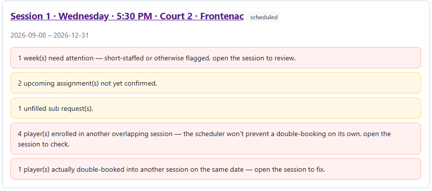

</td>
<td width="50%">

**One week on the session detail page.** Each player's status with Reassign, Resend link, and Mark confirmed, plus ball duty and the buttons that apply to the whole week.
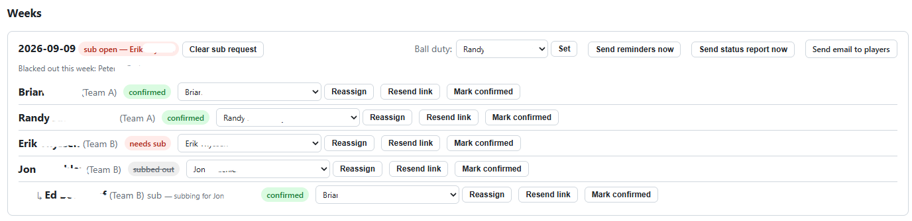

</td>
</tr>
<tr>
<td width="50%">

**Roster and target games.** Check off who's in the session and set their targets. The totals update as you type, so you know when the numbers work.
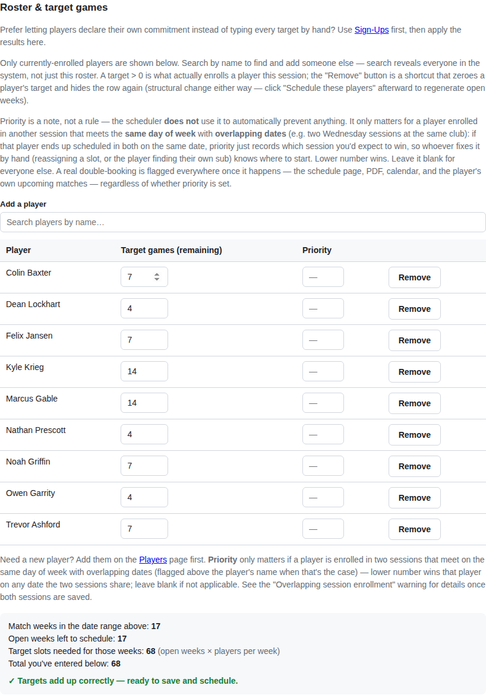

</td>
<td width="50%">

**Players: Public name and Full name.** A short name for pages other players can see, and a full name that only shows up on admin pages and in emails.
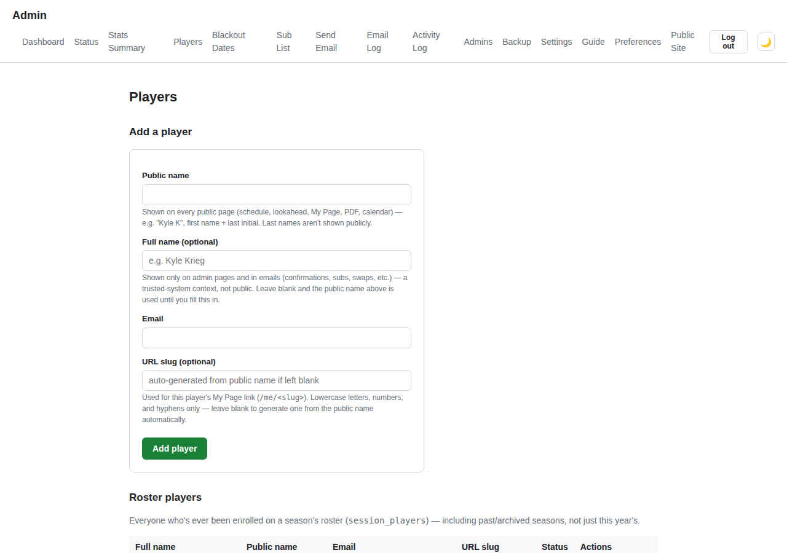

</td>
</tr>
<tr>
<td width="50%">

**Broader Sub List.** Everyone who's willing to sub, across the whole site. Each session then picks which of them it uses.
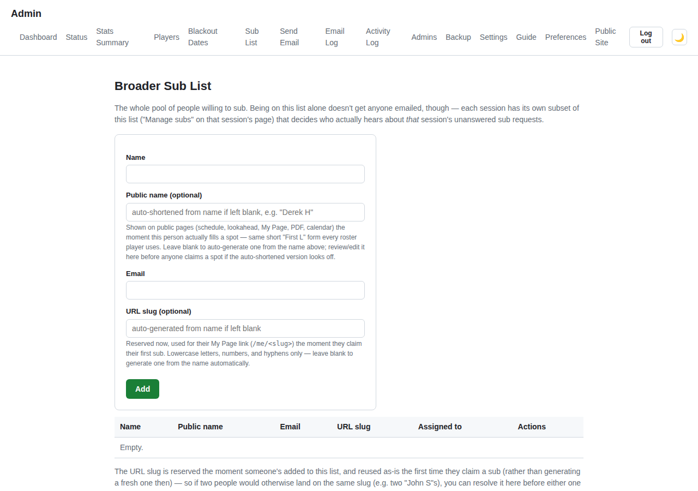

</td>
<td width="50%">

**Session detail page.** All the buttons you need to run a season week to week.
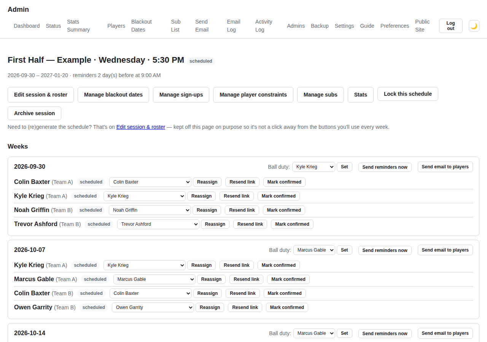

</td>
</tr>
</table>

### Player side

The in-app `/help` page covers all of this, with a mockup of every email. A few examples:

<table>
<tr>
<td width="33%">

**My Page**


</td>
<td width="33%">

**Request a Sub**


</td>
<td width="33%">

**Full Season Schedule** (with weather)
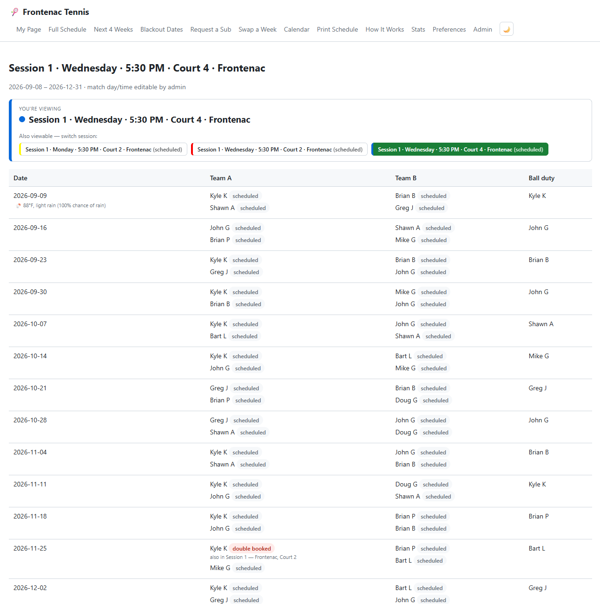

</td>
</tr>
</table>

## Features

### For players (no login needed)

- **Season scheduler.** Every player gets exactly their target number of games, or the app tells you why that isn't possible. Partners and ball duty get spread around evenly. If you have enough players for more than one court, it handles that too (players per week just has to be a multiple of 4).
- **My Page** (`/me`). One bookmarkable page per player covering every session they're in: upcoming matches, ball duty, sub and swap buttons, and a calendar link.
- **Blackout dates, Request a Sub, Swap a Week.** Before the schedule is made, players mark the dates they can't play. After that, they can request a sub (which goes out to the whole roster) or trade a week directly with one teammate. Anything that changes the schedule requires clicking a link from an email first, so nothing happens by accident.
- **Calendar, PDF, stats, and leaderboard.** A calendar feed that updates itself, a one-page printable schedule, a public table of targets, games played, and ball duty, and leaderboards for games won and win %. There are leaderboards per session, per season (a group of sessions you name), and on a master board you can reset, with graphs for win % and games per match.
- **Weather, dark mode, text size, and a phone-friendly layout.** Players set these themselves and their browser remembers them.
- **Double-booking warnings.** If someone is in two sessions that land on the same date, they see it everywhere they'd look (schedule, My Page, PDF, calendar) weeks ahead of time. The admin isn't the only one who finds out.

*For a full walkthrough with every email shown, see `/help` in the app.*

### For admins (password protected; Admin → Guide has the details)

- **Roster and targets.** Totals are checked as you type. Each player has a short **Public name** that other players see and an optional **Full name** for admin pages and emails.
- **Player-pair rules.** For example, "these two should never play the same week" or "these two should always play the same week." The app checks whether the rule can actually be met and tells you if it can't, instead of quietly ignoring it.
- **Two-level sub list.** A site-wide **Broader Sub List**, and for each session, the subset of those people who get emailed when that session comes up short.
- **Status page and dashboard flags.** One place to see everything a person needs to deal with: short-staffed weeks, unfilled subs, swaps nobody answered, double-bookings, paused reminders. It also previews the reminder emails due over the next 7 to 30 days, so you can see the system is running.
- **Multiple sessions at once.** Different clubs, different courts, or a season split into two halves. Each session has its own name, color, and club info, which show up in its emails. If the same player is enrolled in overlapping sessions, you get a warning when you save the roster. If they end up actually double-booked, **Resolve conflicts…** suggests fixes.
- **Activity Log and Email Log.** A record of every admin action and every email sent, for when someone says "I never got that."
- **Manual controls.** Reassign a spot, mark someone confirmed, change ball duty, send a one-off email (to a player, a roster, a week, or a test of any template), and add a **one-time sub (not on roster)** for someone who was lined up outside the app.
- **Database backups.** A backup button, a nightly cron job, and an off-site copy over rsync/SSH. See "Backing up the database" below.
- **Weather forecasts**, turned on per session. Check a box and enter a latitude and longitude. See `/admin/guide#weather-setup` for the API key and troubleshooting.
- **Ad-hoc sessions.** A second kind of session for pickup games. No targets and no blackout dates. People sign up first come, first served, and every 4 sign-ups make a court.

*For a full walkthrough, including when each email goes out, see **Admin → Guide** in the app.*

## How the self-service flows work

These are the same flows `/help` and `/admin/guide` walk through, drawn as diagrams so you can see how each one plays out (including what happens if nobody responds) without clicking through the site.

### Confirming a match

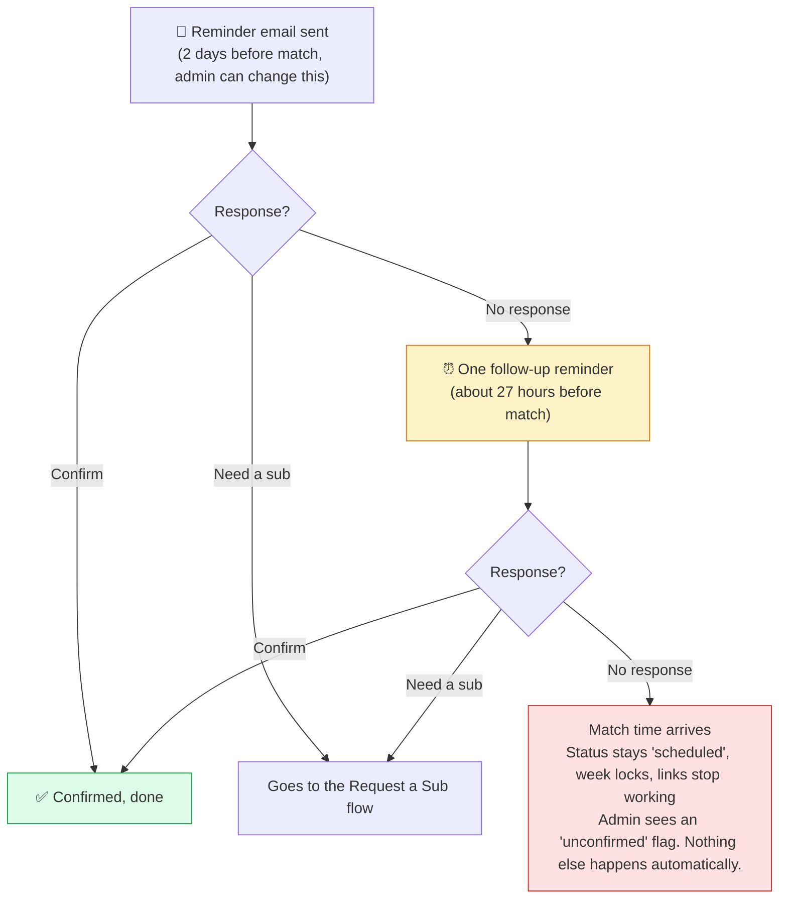

### Request a Sub

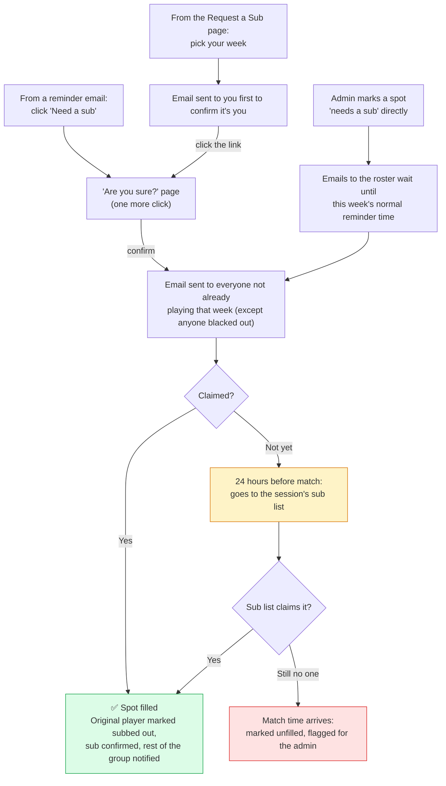

*An admin can step in at any point: reassign the spot, mark the original player confirmed after all, or cancel the request, which puts the player back to "scheduled."*

### Swap a Week

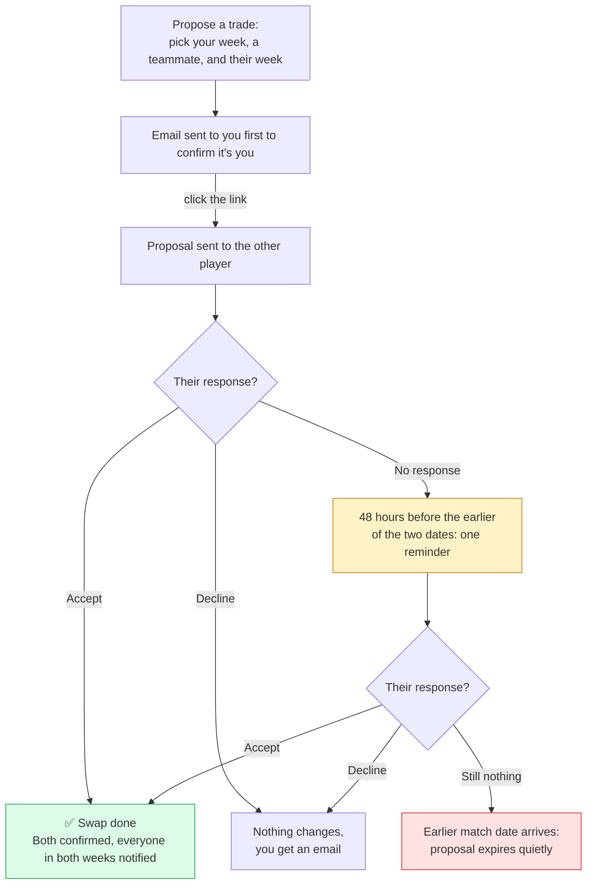

### Ad-hoc pickup games

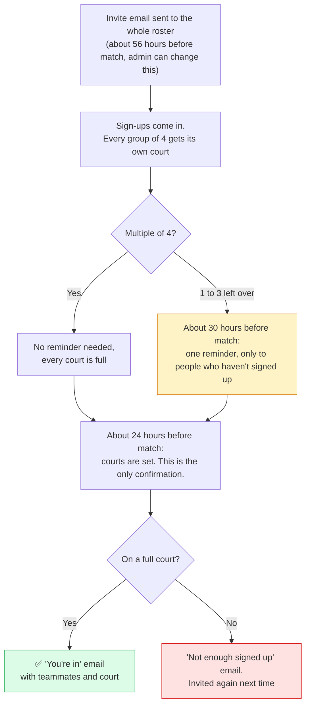

## What's here

```
src/
  db/            SQLite schema and connection (uses Node's built-in node:sqlite, so nothing to compile)
  scheduler/     The scheduling engine (max-flow plus a partner-variety search) and its tests
  services/      Email, ICS, PDF, cron, tokens, auth, time zones, weather, and the sub/confirm logic
  routes/        Express routes: public/ (no login) and admin/ (password protected)
  views/         EJS templates
  public/        Static CSS
  scripts/       Command-line helpers (hashing the admin password, etc.)
```

## Installing from scratch

All you need is a machine with internet access.

1. **Get the code.** Clone the repo (skip this if you already have it):
   ```
   git clone https://github.com/kylekrieg/tennis-scheduler.git
   cd tennis-scheduler
   ```

2. **Install Node.js 22.5 or newer.** The app uses Node's built-in `node:sqlite` module, which needs 22.5 or later. The upside is there's nothing native to compile.
   ```
   node --version   # needs to be 22.5 or higher
   ```
   If Node isn't installed at all:
   ```
   curl -fsSL https://deb.nodesource.com/setup_22.x | sudo -E bash -
   sudo apt-get install -y nodejs
   ```

3. **Install dependencies.** From the `tennis-scheduler` folder:
   ```
   npm install
   ```
   This should only take a few seconds, since nothing needs `node-gyp` or a C++ compiler.

4. **Create your `.env` file** from the template:
   ```
   cp .env.example .env
   ```

5. **Make an admin password hash** and put it in `.env`:
   ```
   node src/scripts/hash-admin-password.js "choose-a-password"
   ```
   Paste the output into `ADMIN_PASSWORD_HASH` in `.env`. This is only used to create the first admin account the first time the app starts. After that, admin accounts live in the database and you manage them from **Admin → Admins**, where you can add other people with their own usernames and passwords. The app doesn't read `ADMIN_PASSWORD_HASH` again after that first start. The first account's username is `admin`, and you can change it from **Admin → Admins** once you're logged in.

6. **Fill in the rest of `.env`:**
   - `SESSION_SECRET`: any long random string (for example, the output of `openssl rand -hex 32`).
   - `PUBLIC_SITE_URL`: `http://localhost:3000` when running locally, or your real domain once it's deployed.
   - `GMAIL_USER` / `GMAIL_APP_PASSWORD`: optional for local testing. If you leave them blank, emails get printed to the console instead of sent. That's enough to test every flow (confirm, sub request, escalation) without emailing anybody.

7. **Start the app:**
   ```
   npm start
   ```
   On the first run it creates `data/tennis.db` (SQLite, so there's no separate database server) and starts the background loop that sends reminders and handles escalations.

8. **Open it in a browser:**
   - `http://localhost:3000/admin`: log in with the password from step 5, click **New Session**, set up the roster, dates, match day and time, and each player's target, then click **Schedule these players**.
   - `http://localhost:3000/schedule` shows the season it built.

   If you'd rather see it working with sample data first:
   ```
   node src/db/seed-example.js
   ```
   This loads the 9-player, 17-week example roster from the scope doc and builds its schedule, so `/schedule` and `/admin` have something to show right away.

That's it for a local install. Everything else (pm2, Cloudflare Tunnel, a real domain) is only for making it reachable from outside your own machine. See **[RASPBERRY_PI_SETUP.md](RASPBERRY_PI_SETUP.md)**.

## Local development notes

- If `GMAIL_USER`/`GMAIL_APP_PASSWORD` aren't set, emails are written to the console instead of sent. They still show up in the Email Log with the status `logged_dev_mode`. This is how you test the confirm, sub, and escalation flows while developing.
- `node src/scheduler/engine.test.js` runs the scheduler's tests (plain `assert` calls, no test framework) against the example roster, plus a few cases that are set up to fail so you can check that conflicts get reported correctly.
- `data/` (the SQLite file) and `.env` are in `.gitignore`. Don't commit either one.

## Deploying to a Raspberry Pi

Step-by-step instructions for going from a fresh clone to a live site on a Raspberry Pi (installing Node, copying the app over, running it under `pm2`, and making it public with a Cloudflare Tunnel) are in **[RASPBERRY_PI_SETUP.md](RASPBERRY_PI_SETUP.md)**.

## Backing up the database

Everything (players, blackout dates, confirmations, subs, the email log) is in one SQLite file, `data/tennis.db`. Backing up means making a clean copy of that file. Restoring means putting a copy back.

**Manual backup.** Click **Backup now** on **Admin → Backup** (that page also lists your existing backups with download buttons), or run:
```
npm run backup
```
Either way you get a timestamped copy in `backups/`. It uses SQLite's `VACUUM INTO`, which is safe to run while people are using the site. You don't have to stop the app, and you won't end up with a half-written file.

**Automatic backup.** Add a cron job on the Pi so it runs every night:
```
crontab -e
```
then add the line below. Replace `pi` with your actual username (run `whoami` if you're not sure). Newer versions of Raspberry Pi OS don't create a `pi` user anymore and have you pick a username during setup.
```
0 2 * * * cd /home/pi/tennis-scheduler && /usr/bin/node src/scripts/backup-db.js >> backup.log 2>&1 && /usr/bin/node src/scripts/backup-offsite.js >> backup.log 2>&1
```
This makes a backup at 2am every night, keeps the newest 30 (about a month's worth), and then copies the `backups/` folder to another machine, which is covered in the next section. If you haven't set up the off-site copy yet, leave off the second `&&` part. `backup-db.js` works fine by itself; the backups just stay on the Pi's SD card.

**Getting backups off the Pi.** If your backups are on the same SD card as the app and that card dies, you lose both. That's the failure you're really protecting against. `npm run backup:offsite` (`src/scripts/backup-offsite.js`) copies the `backups/` folder to another machine using `rsync` over SSH. rsync only sends files that are new or changed, so it stays quick even with a month of nightly backups in the folder. The steps below set it up from scratch and cover a couple of SSH problems that tend to trip people up the first time. They work the same whether you're on a Pi or something else.

**What you need:** a second machine you can SSH into, like another computer on your network, a NAS, or a cheap VPS. It needs an SSH server and `rsync`. Most Linux and macOS machines have both; on Debian or Ubuntu, run `sudo apt install openssh-server rsync` if they're missing. The machine running the app needs `rsync` too. Raspberry Pi OS comes with it; otherwise run `sudo apt install rsync`.

1. **Make a separate SSH key** on the machine running the app. Don't reuse your personal key. That way you can revoke this one by itself if you ever need to:
   ```
   ssh-keygen -t ed25519 -f ~/.ssh/tennis_backup -N ""
   ```
   `-N ""` means no passphrase. The key has to work from cron, and nobody will be around to type one in.

2. **Copy the public key to the other machine** so the app server can log in without a password:
   ```
   ssh-copy-id -i ~/.ssh/tennis_backup.pub you@your-other-machine
   ```
   It asks for that account's password once and then installs the key. Make sure the folder you're backing up into (for example, `/home/you/tennis-backups`) already exists on that machine. `rsync` won't create it for you.

3. **Accept the other machine's host key by hand first.** The first time you SSH to a new host, it asks "Are you sure you want to continue connecting (yes/no)?" If that question comes up inside a cron job, the job will hang or fail because nobody's there to answer it. Connect once manually to get it out of the way:
   ```
   ssh -i ~/.ssh/tennis_backup you@your-other-machine echo ok
   ```
   Type `yes` if it asks, and it should print `ok`. If it prints `ok` without asking, you're already set.

4. **Add the connection details to `.env`** (`.env.example` has the full list):
   ```
   OFFSITE_SSH_HOST=your-other-machine.local
   OFFSITE_SSH_USER=you
   OFFSITE_SSH_PATH=/home/you/tennis-backups
   OFFSITE_SSH_KEY=/home/pi/.ssh/tennis_backup   # swap "pi" for your username if it's different
   ```
   `OFFSITE_SSH_HOST` can be a hostname, a `.local` name (if both machines are on the same network), or an IP address. If the other machine uses a different SSH port, set `OFFSITE_SSH_PORT` too. It defaults to 22.

5. **Test it by hand:** `npm run backup:offsite`. It should finish without printing anything. Check the other machine for the `.db` files. If something's wrong, running it this way shows you the real `rsync` or `ssh` error instead of hiding it in a cron log (see Troubleshooting below).

6. **Add the cron line above**, or tack `&& npm run backup:offsite` onto the line you already have.

Once this is set up, **Admin → Backup** also has a **Push off-site now** button for when you want a copy right away, like after you finalize a season's roster. It runs the same code as the cron job. If `OFFSITE_SSH_HOST`, `OFFSITE_SSH_USER`, or `OFFSITE_SSH_PATH` are blank, the script prints a one-line "not configured" message and exits without an error, so the cron job doesn't fail. The local backup is already done by then anyway.

**Troubleshooting:**
- **"Permission denied (publickey)":** The public key isn't installed on the other machine, or `OFFSITE_SSH_KEY` in `.env` points to the wrong private key. Run `ssh-copy-id` again and check the path.
- **"Host key verification failed":** Either step 3 got skipped, or the other machine's host key changed (because it was reinstalled, for example). Delete that host's line from `~/.ssh/known_hosts` on the app's machine and connect once by hand to accept the new key.
- **Connection hangs or times out:** The app's machine can't reach the other machine on port 22 (or whatever `OFFSITE_SSH_PORT` is set to). Check the firewall on the other machine. If it's behind a router or a cloud provider, make sure the port is open or forwarded.
- **"rsync: command not found":** Install `rsync` on whichever machine is missing it.
- **Destination folder doesn't exist:** `rsync` won't create the `OFFSITE_SSH_PATH` folder. Create it on the other machine first (`mkdir -p /home/you/tennis-backups`).

If you'd rather back up to cloud storage (Google Drive, Dropbox, Backblaze B2, S3, and so on), look at `pushBackupsOffsite()` in `src/services/offsiteBackup.js`. It's a short function. Replace its `rsync`/`ssh` call with `rclone sync backups/ remote:path`, and the cron job, the admin button, and the "not configured" handling all keep working as they are.

**Restoring a backup** (the database is bad, but the Pi is fine):
1. Stop the app: `pm2 stop tennis-scheduler`
2. Copy the backup over `data/tennis.db`: `cp tennis-backup-20260806-020000123.db data/tennis.db`. If `data/tennis.db-wal` or `data/tennis.db-shm` exist, delete them so nothing from the old database gets mixed in.
3. Start it again: `pm2 start tennis-scheduler`
4. Make sure `/admin` loads and the roster and sessions look right.

**Restoring when the Pi itself is gone** (dead SD card, lost or stolen Pi, moving to new hardware): The `.db` backup has every player, session, schedule, and log entry. It does **not** have `.env`, which only lives on the Pi and isn't part of any backup. So recovery has two parts:

1. Set up a new Pi following [RASPBERRY_PI_SETUP.md](RASPBERRY_PI_SETUP.md): clone from GitHub, `npm install`, `cp .env.example .env`.
2. Fill in the new `.env`. Most of it doesn't have to match what you had before:
   - `ADMIN_PASSWORD_HASH`: anything valid works (`node src/scripts/hash-admin-password.js "temp-password"`). It's only used to create an admin in an empty database. Once you restore your backup in the next step, your real admin logins are already in it and this value is ignored.
   - `SESSION_SECRET`: any new long random string. It doesn't have to match the old one. Changing it just logs out anyone who's currently logged in.
   - `GMAIL_USER` / `GMAIL_APP_PASSWORD`: you can't recover the old app password, because Google never shows it again. Sign into the Gmail account and create a new one (Google Account → Security → App passwords), the same way you did the first time.
   - `PUBLIC_SITE_URL`, `PORT`, `SQLITE_PATH`, `BACKUP_DIR`, `OFFSITE_SSH_*`: regular settings, not secrets. Put back what you had if you remember it, or work it out from how your tunnel and domain are set up. The defaults are fine to start with.
3. **Before** starting the app, copy your newest `.db` backup to `data/tennis.db`. Do this before you run `pm2 start` or `npm start`, so the app doesn't create a fresh empty database first.
4. Start the app, check that `/admin` loads with your real logins and roster, and send yourself a test email (Admin → Send Email) to make sure the new Gmail app password works.

This is why the off-site copy matters. A backup on the same SD card as everything else is no help when the SD card is what died.

## Starting fresh with a clean database

If you've been testing with sample data (for example, `npm run seed:example`) and want to clear it out before adding your real roster, don't just delete `data/tennis.db`. That deletes your admin login too. Run this instead:
```
npm run reset-data -- --confirm
```
It deletes all players, sessions, schedules, blackout dates, sub requests, and email log entries, but **keeps your admin logins and settings (time zone)** so you can still get in. It makes a backup in `backups/` first, same as `npm run backup`, in case you want anything back. Without `--confirm`, it only prints what it would delete and doesn't change anything. The `--` before `--confirm` is needed so npm passes the flag along to the script.

Then add your real players under Admin → Players and create a session from Admin → New session.

## Implementation notes

- **Database:** Uses Node's built-in `node:sqlite` (Node 22.5 and up) instead of `better-sqlite3`, so `npm install` never has to compile anything. That matters most on a Raspberry Pi, where native builds cause the most deployment headaches. Changes to existing tables go through a small migration check in `src/db/index.js` so upgrades don't wipe your data.
- **Scheduler** (`src/scheduler/engine.js`): First it uses max-flow to decide who plays which week. That either finds a valid schedule or proves there isn't one and reports why. Then it runs a limited simulated-annealing pass to spread out partner pairings. Last, it hands out ball duty in proportion to each player's share of the games.
- **Tokens:** Generated with `crypto.randomBytes(32)`, and only a SHA-256 hash is stored in the database. GET requests only display pages; only POST requests change anything. That includes the "Request a Sub" page, which creates a token and then uses the same flow as a link from an email.
- **Time zones:** Match time, reminder time, and the escalation deadline are all calculated in the time zone set under Admin → Settings, with proper local-time conversion (`src/services/tz.js`) instead of plain UTC math. This matters if you're not on UTC.
- **Open questions from the spec:** The four open items in `Full_Scope_Of_Work.md` §10 were settled (and signed off) like this: a confirmed player can request a sub at any time, with no cutoff; if an admin reassigns someone onto one of their blackout dates, they get a warning but it's allowed; if two sub requests come in for the same week at once, v1 doesn't handle it automatically and the second one goes to the admin; and overlapping sessions are allowed.
