<!-- Generated from the app's /admin/guide page by `npm run guides` (src/scripts/write-guides.js). Edit the page, not this file. -->

> This is a copy of the **Admin Guide** page built into the app (/admin/guide). Example names, clubs and dates are made up.

# Admin Guide

How to run a session from start to finish. Players can't see this page. For what players see, look at [How It Works](USER_GUIDE.md).

**Jump to:**

-   [1\. Create a new session](#new-session)
-   [2\. Build the roster & set targets](#roster)
-   [3\. Collect blackout dates](#blackouts)
-   [4\. Schedule the players](#schedule)
-   [5\. Running it week to week](#week-to-week)
-   [6\. The full email/notification timeline](#timing) — start with the [email map](#email-map)
-   [7\. Keeping an eye on things](#monitoring)
-   [8\. Running more than one session at once](#multi-session)
-   [9\. Weather forecast](#weather-setup)
-   [10\. Seasons, leaderboards & news](#stats-news)
-   [11\. Wrapping up a session](#wrapping-up)

## 1\. Create a new session

From the **Dashboard**, click **\+ New session**. Fill in the day of the week, match time, when reminders go out, players per week (a multiple of 4: 8 for two courts, 12 for three), and the club name and court info. The club and court info show up in every email and on every player page for this session. A new session starts as a **draft**, and players won't see anything until you've built the roster and clicked Schedule.

The form also has **Admin status report email(s)**. Enter your email address (or several, separated by commas) and you'll get a status report before each week's match: who's confirmed, who hasn't, who needs a sub and whether it's been filled, and who swapped. You pick how many hours before the match it goes out (the default is 8). Leave the field blank to turn it off. Each week's card on the session detail page also has a **Send status report now** button if you want to see one without waiting.

Further down the form is the **Weather forecast** checkbox and the latitude/longitude fields. See §9 for what that does and how to fix it if it stops updating.

## 2\. Build the roster & set targets

The roster table on the Edit page only shows players who are already in this session. Everyone else is hidden so the table doesn't get huge as your player list grows. To add someone who isn't showing, find them with the **search box** above the table. Once you click into their target field or type a number, their row stays visible.

Each player's **target games** for the season have to add up to exactly *(number of match weeks) × (players per week)*. The page does this math as you type, so you know whether it works before you save. The **Remove** button on a row sets that player's target to zero and hides them again, which is the quick way to take someone out of the session.

If a player isn't in the system yet, add them on the **Players** page first. Players are shared across all sessions, so if someone is already in another session, you just add them here. You don't create them again.

**Priority** is optional. It only matters if this player is also in another session on the same day of the week with overlapping dates. It's a note for whoever sorts out a conflict by hand. The scheduler doesn't use it (see §8).

If you lower someone's target partway through the season (after a roster change, for example), the original number is kept. The Stats page shows both numbers when they're different, so you don't lose track of what it used to be.

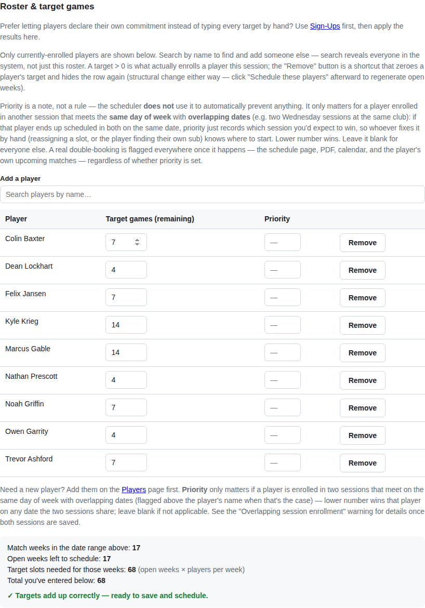

*The summary at the bottom tells you when the targets add up, so there's no counting by hand before you click Schedule.*

Every player has two names, both set on the **Players** page. The **Public name** is what shows up anywhere players can see it (schedule, My Page, PDF, calendar). Keep it short, like "Kyle K," so last names stay off public pages. The **Full name** is optional and is used on admin pages and in emails, which only you and that player see. If you leave Full name blank, the public name is used everywhere, including emails. This only changes what's displayed. The scheduler, targets, and everything else treat both names as the same player.

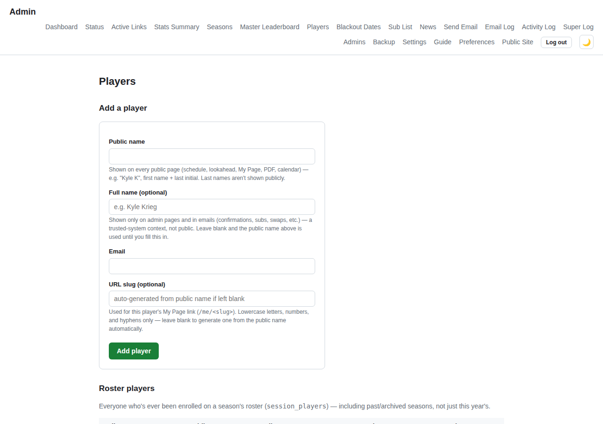

*Players see each other's Public name. You and the emails use the Full name. Only the public name is required.*

**Injured players.** When a player is going to be out for a while (surgery, an injury), check **Injured** on their row on the **Players** page, pick the last day they're out under "Out through," and click **Set**. It covers every session they're in:

-   Each of their weeks through that date turns `needs sub` right away, but nothing is emailed yet. Each week's sub request goes to the roster when that week's normal confirmation reminder goes out, then follows the usual sub list timing. It's the same as picking "— Needs a sub —" on Reassign for every week.
-   A week where they had ball duty is flagged for you to reassign.
-   The player gets one email saying they're marked out through that date and listing their weeks. They get another if you change the date.
-   Those dates count as blackout dates, so they won't be asked to sub or swap, and a session that hasn't been scheduled yet leaves them off.
-   **Out longer?** Move the date later and the new weeks are flagged the same way.
-   **Back early?** Move the date earlier or uncheck the box. Any week whose sub request hasn't gone out yet goes back to scheduled. If it has already gone out, it plays out, and if a sub already took the spot, it stays that way.
-   The box clears itself the day after the date.
-   Only one sub request can be open per week. If another player already has one open that week, the injured player's week waits, shows on the **Status page**, and is flagged as soon as the other request closes. Weeks in a session whose schedule isn't locked yet can't be flagged either. They show on the Status page, and re-running "Schedule these players" will move the player off those dates.

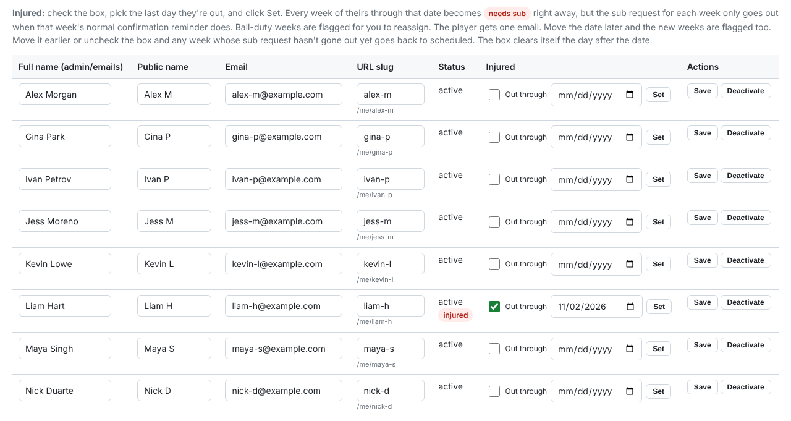

*One player marked injured. The message at the top of the page after you click Set lists every week that changed.*

Each session also has its own **Manage subs** page (next to Manage blackout dates on the session detail page). It's a checklist of the people from your **Sub List** who should get emailed when this session can't fill a sub request from its own roster. Set this up before you schedule. Someone who only plays Tuesdays shouldn't get emails about an open spot in a Thursday session. If a session has nobody checked here, an unfilled request just goes to "unfilled" without emailing anyone.

Manage subs actually has two checklists: your Sub List, and every active **player** who isn't on this session's roster. The second one is useful when two sessions can cover for each other (say, two small sessions at the same club), and it saves you from adding the same person to the Sub List just so they can sub.

On the Sub List page you can edit a name or email in place. Fixing a typo won't remove them from the sessions they're already assigned to. It also has the same Public name field as the Players page, since a sub's name shows up on public pages as soon as they fill a spot.

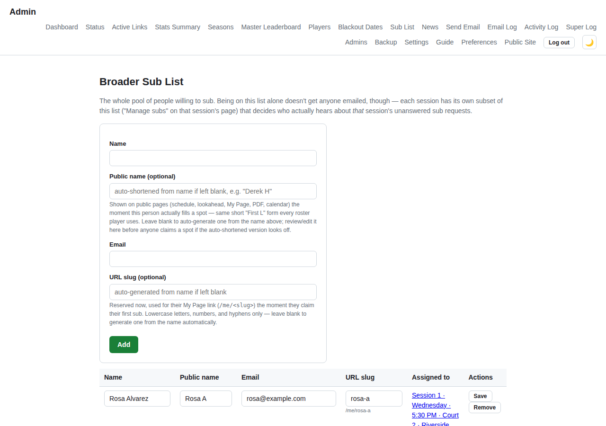

*Same Public/Full name setup as Players. Check the automatically shortened public name before anyone takes a spot, in case it guessed wrong.*

## 2b. Or: let players sign up for themselves

Instead of typing in everyone's target games, you can save the session and then use **Manage sign-ups** on its detail page. Check off who's going to be on the roster, set what full, half, and quarter time mean as a percentage of the season's weeks (75/50/25 by default), and send the notice. Each player picks a level and sees how many weeks that comes out to. When you review the results, the page warns you if the total doesn't match the available spots (the same check the roster page does as you type). When it looks right, click **Apply to roster**. That fills in target games on the Edit page, the same as if you'd typed them yourself. You can still change anyone's number afterward. This is optional. You can schedule without it.

## 3\. Collect blackout dates

Before you run the schedule, give players a chance to mark dates they already know they can't make. On the session's **Manage blackout dates** page, click **Notify roster**. Everyone in the session gets an email with a link to enter their dates, with their name already filled in so nobody picks the wrong one. This doesn't happen automatically when you create a session, because you may still be changing the roster. You can send it again whenever you need to. Players can keep changing their blackout dates until you schedule. After that they can't add dates anymore and use **Request a Sub** to miss a week instead.

After the schedule is made, a player can still **remove** an upcoming blackout date if their plans change. There's an **Edit dates** button next to their blackout dates on My Page and on the public Blackout Dates page. It emails them a link (good for 7 days) to a page where they can remove upcoming dates, including ones you entered for them. They can't add any there. Removing a date doesn't change the schedule. It just means they can be asked to sub or swap that week, and a later "Schedule these players" run can use them. Each removal shows up in the **Activity Log** as `blackout.self_remove`, and the link is listed on Active Links until it expires.

Blackout dates belong to the player, not to a session. If a player is in two sessions with a match on the same date, blacking out that date in either session covers both. The **Manage blackout dates** page always shows all of a player's dates no matter which session you open it from, and you can change any of them there. You never have to go find the session where a date was first entered.

To see everyone's dates for every active session at once, use **Blackout Dates** in the nav (between Players and Sub List). It's a read-only page with one row per player, showing their sessions and every date they've entered. Players who haven't entered anything show a dash, so it's also a quick way to see who hasn't done it yet. You still make changes from a session's Manage blackout dates page. This page is just for looking.

### Player constraints (optional)

**Manage player constraints** on the session detail page lets you say two players should **never** play the same week, or should **always** play the same week (a couple who carpool, say). The scheduler follows these when it builds the schedule. They aren't checked when you Reassign by hand or when players sub or swap, so keep an eye on those yourself.

## 4\. Schedule the players

When the roster and blackout dates are ready, go to the session's Edit page and click **Schedule these players**. The scheduler works from whatever's saved. Every player gets their target number of games, partners get mixed up evenly, and ball duty rotates based on how many games each person plays.

If something doesn't work (the targets don't add up, a week doesn't have enough available players, or a player's blackout dates make their target impossible), you get a message telling you specifically what's wrong. In most cases it still builds the rest of the schedule. A short week, for example, gets flagged and filled with whoever's available instead of holding up the whole season. If you run it again later (after a roster change, or once blackout dates are in), it only changes weeks that haven't been played. Past weeks stay locked.

### How targets get met

Normally every player gets exactly their target. The scheduler solves it as an exact matching of players to weeks, not an estimate, so if a valid schedule exists it will find it. For that to be possible, targets have to add up to *weeks × players per week*, which is what the roster page checks as you type. There are only two cases where a player ends up short, and they're handled differently:

**A whole week is short-staffed.** Too many people blacked out the same date, so that week gets cut down to as many full courts as the available players can fill. Nobody's target is adjusted to make up for it. That's on purpose, so you decide how to rebalance instead of the app doing it quietly and unevenly. The players who would have played that week just end up short for the season. The Stats page shows who and by how much. If you want to make it up, that's up to you (raise a target the next time you re-schedule, bring in a sub, and so on).

**A player's own blackout dates make their target impossible.** For example, they blacked out more weeks than their target leaves room for. In this case the scheduler does adjust. That player's target is lowered to what they can actually play, and the extra games go to other players who have room, one game at a time, starting with whoever has the lowest target. That way a shortfall of several games is spread over a few people instead of landing on one. The target you typed on the roster page isn't changed. This only affects that one scheduling run. Every adjustment is listed in the message you see after clicking "Schedule these players," and on the Stats page afterward. If the other players don't have enough room to take the extra games, or the problem involves several players and weeks and can't be traced to one person's dates, it's reported as a conflict for you to fix instead of the app guessing.

When you're happy with the schedule, click **Lock this schedule** on the session detail page. This is what turns on sub requests: until the schedule is locked, players don't see **Need a sub**, **I found a sub**, or **Request a sub**, and you can't mark a spot "— Needs a sub —". That keeps any shuffling you do while finishing the schedule from turning into fake sub history. Swaps work either way. Locking doesn't stop you from changing the roster, re-scheduling, or editing blackout dates. It also adds a badge and a timestamp so you can tell later which version you signed off on. **Unlock schedule** removes it if you need to make more changes.

## 5\. Running it week to week

Most weeks you won't have to do anything. Reminders, follow-ups, and sub requests all run on their own. When something does need you, the session detail page lets you **Reassign** a spot, **Mark confirmed** for someone, change **ball duty**, or **Add a player** to a short week. Players handle blackout dates, sub requests, and swaps themselves. You only need to get involved if something gets stuck, like a sub request nobody takes or a swap nobody answers. Both of those get flagged for you (see §7).

A confirmed player also gets an **Unconfirm** button. It sets them back to "scheduled" without sending anything, so the regular reminder or follow-up asks them to confirm and the dashboard flags them as unconfirmed again. When someone takes a sub spot from a sub request *before* that week's reminder time, they now start as "scheduled" too and confirm through the regular reminder like everyone else. If they take it after the reminder has gone out, taking it counts as confirming.

Next to the Reassign button is an **as sub** checkbox. It's ticked for you when that spot has an open sub request. When it's ticked and you pick someone from the roster, the original player stays on that week as "subbed out" and the new player shows up underneath as their sub. It also counts as a sub game on Stats and shows up in Sub History. No email goes out right away; the sub gets that week's normal reminder. Untick it if you're just changing who holds the spot, not covering for someone. Picks from the sub list and one-time subs are always recorded as subs. A blackout date on the player you pick is still just a warning, same as before.

The Reassign dropdown has a **— Needs a sub —** option for when you need to step in yourself, like when a player has a hard conflict and hasn't dealt with it. It marks the spot the same way the player's own request would, but it doesn't send any email right away. Candidates get emailed when that week's normal reminder time comes around. You shouldn't need this often. Players already have Request a Sub and Swap a Week, so save this for when you really have to act for someone.

There's also **— One-time sub (not on roster) —**, for when a player finds a replacement completely outside the app: a friend, a guest, anyone who isn't a player and isn't on your Sub List. Pick it and type a name. The app creates a basic player record and puts them in as a confirmed sub for that one week. It doesn't ask for an email address, so this person never gets any automatic emails. In the Email Log their rows show "skipped — no email," which is expected and not an error. Only use this for a true one-time guest. Anyone who might play again should go on the roster or the Sub List.

Once a week has been played and locked, Reassign goes away. If the record is wrong (a player found their own sub and didn't tell anyone), open **Wrong person listed?** next to that player's games-won box and use **Correct**. The listed player becomes "subbed out," the person who really played is added as their sub, and any games-won score already entered on the wrong row is cleared. No emails go out.

Each open week's card also has a **Send email to players** button. It's a simple form (subject and message, no template) that sends one email to everyone scheduled or confirmed for that week, not the whole roster. It's good for things like "we're on the next court over this week." To email a whole session's roster, or to test what one of the built-in emails looks like, use the **Send Email** page in the nav. The bottom of that page has **Email templates — preview**: every automatic email the app sends, built from a sample player's real schedule, with its subject, when it goes out, and who gets it. Click **Preview** to see the full email. Nothing is sent and nothing goes in the Email Log.

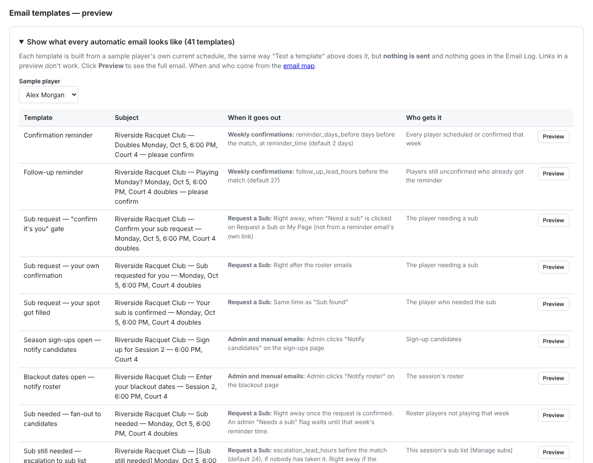

*Pick a sample player to see the emails built from their schedule. Links inside a preview don't work.*

*One week's card. Each player row has its badge, Reassign (with the "as sub" checkbox), Resend link, and Mark confirmed or Unconfirm. Across the top are the controls for the whole week: ball duty, sub request, reminders and email (plus status report and weather when those are turned on).*

### Player status badges (session detail page)

Each player row shows one badge, and that's what you look at when checking over a week. The `email sent - unconfirmed` badge is only shown to admins. To the player it's still just "scheduled." You see the difference so you can tell "reminded, no answer yet" apart from "hasn't been reminded yet."

| Badge | Meaning |
| --- | --- |
| `scheduled` | Playing, no reminder sent yet. |
| `email sent - unconfirmed` | Reminder sent, no answer yet. It gets `(×2)` added once the follow-up goes out too. It's still "scheduled" underneath, so there's nothing you have to fix. |
| `confirmed` | Player confirmed. |
| `needs sub` | Someone asked for a sub for this spot (the player, you with — Needs a sub —, or the player is marked injured) and it hasn't been filled. |
| `subbed out` | Someone else took this spot. The sub shows on the row underneath it. |
| `double booked` | Also scheduled in another session on the same date (see §8). It shows in place of scheduled, confirmed, or email sent - unconfirmed. Once the spot changes to needs sub or subbed out, the real status shows again. |

## 6\. The full email/notification timeline

Section 5 covers what you do. This section covers what the app does by itself, and when. The first few flows match the ones on the player's [How It Works](USER_GUIDE.md#timing) page, shown from your side with the places you can step in. After those come the pickup game flow (also on [How It Works](USER_GUIDE.md#adhoc)) and one that's only for you: the status report email. It's good to know these well, because they're how you tell whether something is really stuck or just hasn't reached its next automatic step.

### Email map: who gets what, when

Every email the app sends in one place. The flowcharts after it walk through the same flows step by step. The same map is in `EMAIL_MAP.md` in the project folder.

#### A normal week (default settings, Wednesday 5:30 PM match)

| When | What | Who gets it |
| --- | --- | --- |
| Monday, reminder time | Confirm reminder | Everyone scheduled that week |
| Monday, 5:30 PM | Swap nudge (48h before) | The player asked to swap, if they haven't answered |
| Tuesday, 2:30 PM | Follow-up reminder (27h before) | Anyone who still hasn't confirmed |
| Tuesday, 5:30 PM | Sub request goes to the sub list (24h before) | This session's sub list, if a normal sub request is still open |
| Wednesday, 9:30 AM | Admin status report (8h before) | The session's admin report addresses |
| Wednesday, 12:30 PM | "I found a sub" warning (5h before) | The player who named a sub that hasn't confirmed; the sub gets a last call |
| Wednesday, 1:30 PM | "I found a sub" opens up (4h before) | Roster + sub list, if the named sub still hasn't confirmed |
| Wednesday, 1:30 PM | Sub still open alert (4h before) | The player who asked + admin report addresses, if a sub request still isn't taken |
| Wednesday, 5:30 PM | Match starts: week locks | No email. Every link for that week stops working; open swaps expire; still-open sub requests are flagged unfilled |
| Thursday, 5:30 PM | Scores reminder (24h after) | That week's ball-duty player, if any scores are missing |
| Friday, 5:30 PM | Second scores reminder (48h after) | That week's ball-duty player, if scores are still missing |

#### Weekly confirmations

Paused for a session when "Send automatic reminders" is off. Manual sends still work.

| Email | Sent when | Who gets it | Setting |
| --- | --- | --- | --- |
| Confirm reminder | reminder\_days\_before days before the match, at reminder\_time (default 2 days) | Every player scheduled or confirmed that week | Reminder days before / reminder time |
| Follow-up reminder | follow\_up\_lead\_hours before the match (default 27) | Players still unconfirmed who already got the reminder | Follow-up email hours |
| Confirm reminder (manual) | Admin clicks "Send reminders now" (re-sends to all) or "Resend link" (one player) | As above | Session page |

#### Request a Sub

Players who have that date blacked out are never asked. Anyone already in that week (playing, or gave their own spot up) is never asked.

| Email | Sent when | Who gets it | Setting |
| --- | --- | --- | --- |
| "Confirm it's you" | Right away, when "Need a sub" is clicked on Request a Sub or My Page (not from a reminder email's own link) | The player needing a sub | — |
| Sub needed (roster) | Right away once the request is confirmed. An admin "Needs a sub" flag waits until that week's reminder time. | Roster players not playing that week | — |
| Your request went out | Right after the roster emails | The player needing a sub | — |
| Sub still needed (sub list) | escalation\_lead\_hours before the match (default 24), if nobody has taken it. Right away if the request comes in later than that. | This session's sub list (Manage subs) | Escalate to broader sub list hours; Status page Suspend / Send now |
| Sub found | When someone takes the spot | Everyone playing that week, including the sub. If the sub took the spot before that week's reminder time, their copy says to confirm when the regular reminder comes | — |
| Your sub is confirmed | Same time | The player who needed the sub | — |
| Your spot still needs a sub | still\_open\_alert\_hours before the match (default 4) if nobody has taken it, or right away if there is nobody left to ask. Once per request. | The player who needed the sub | Sub still open alert hours |
| Sub still needed (admin) | Same time | Admin report addresses | Admin report emails |

#### I Found a Sub

Nobody else is asked while the named sub has time to answer; the normal escalation time does not apply. Admins can confirm the named sub from the session page. A sub named less than (deadline + 1) hours before the match gets no follow-up at all.

| Email | Sent when | Who gets it | Setting |
| --- | --- | --- | --- |
| "Confirm it's you" | Right away, when started from My Page (not from a reminder email) | The player | — |
| Asked you to sub in | Right away | The named sub | — |
| Sub request sent to X | Right after, listing the exact times below | The player | — |
| New sub list entry | Right away, only if the named sub is new to the app | Admin report addresses | Admin report emails |
| Reminder / hasn't confirmed yet | self\_arranged\_reminder\_hours after naming the sub (default 4), if still unconfirmed | The named sub and the player | "I found a sub" remind hours |
| Warning / last call | 1 hour before the deadline | The player (warning) and the named sub (last call) | "I found a sub" open-up hours |
| Sub needed (roster) + sub still needed (sub list) | self\_arranged\_deadline\_hours before the match (default 4), if still unconfirmed | Roster players not playing + this session's sub list, at the same time | "I found a sub" open-up hours; Status page Suspend / Send now |
| Your spot is open to other players | Same time | The player | — |
| Late "I found a sub" | Within a minute, if the sub was named less than (deadline + 1) hours before the match | Admin report addresses | Admin report emails |
| Sub found / your sub is confirmed | When the named sub (or anyone) takes the spot | As in Request a Sub | — |
| Still open alerts | As in Request a Sub, but only after the spot has opened up. If it opens up at or after the alert time, only the admins get one (the player was just told). | The player and admin report addresses | Sub still open alert hours |

#### Swap a Week

Not paused by the reminders toggle.

| Email | Sent when | Who gets it | Setting |
| --- | --- | --- | --- |
| "Confirm it's you" | Right away, when a swap is proposed | The player proposing | — |
| Swap request | Once they confirm | The player being asked | — |
| Your swap request went out | Same time | The player proposing | — |
| Swap nudge | 48 hours before the earlier of the two matches, if unanswered | The player being asked | Fixed |
| Swap declined | When they decline | The player proposing | — |
| Swap accepted | When they accept | Both players | — |
| Swap group notice | When they accept | The other players in each of the two weeks | — |

#### Pickup (ad-hoc) sessions

Not paused by the reminders toggle.

| Email | Sent when | Who gets it | Setting |
| --- | --- | --- | --- |
| Invite | adhoc\_invite\_lead\_hours before the match (default 56) | Everyone on the invite list | Invite email hours |
| Straggler reminder | adhoc\_reminder\_lead\_hours before (default 30), only if nobody has signed up or the sign-ups do not fill whole courts | Invited players who haven't signed up | Reminder email hours |
| You're in / final roster | adhoc\_final\_lead\_hours before (default 24) | Everyone on a full court | Final roster email hours |
| Not enough signed up | Same time | Anyone left without a full court | Final roster email hours |

#### Scores

| Email | Sent when | Who gets it | Setting |
| --- | --- | --- | --- |
| Scores still needed | games\_won\_reminder\_lead\_hours after the match (default 24), if any games-won are missing | That week's ball-duty player | Ball duty scores reminder hours (only when Stats is on) |
| Scores still needed — second reminder | games\_won\_second\_reminder\_hours after the match (default 48, 0 = off), if games-won are still missing | That week's ball-duty player | Ball duty scores second reminder hours (only when Stats is on) |

#### Admin and manual emails

| Email | Sent when | Who gets it | Setting |
| --- | --- | --- | --- |
| Admin status report | admin\_report\_lead\_hours before the match (default 8); also "Send status report now" | The session's admin report addresses | Admin status report email(s) / hours |
| Blackout dates are open | Admin clicks "Notify roster" on the blackout page | The session's roster | — |
| Season sign-ups are open | Admin clicks "Notify candidates" on the sign-ups page | Sign-up candidates | — |
| Custom email | Admin sends from Send Email or "Send email to players" | Whoever the admin picks | — |
| "My Other Dates" link | Player asks for it on My Page | That player | — |
| Injured notice | Admin marks a player Injured on the Players page, or changes their "out through" date | That player | Players page |
| Edit blackout dates link | Player clicks "Edit dates" on My Page or the Blackout Dates page | That player | — |

#### Rules that apply to every email

-   Each automatic email goes out once per person per week. The cron checks the Email Log before sending, so a restart never re-sends. "Send reminders now" and "Send status report now" deliberately re-send.
-   Archived sessions send nothing automatic.
-   The Status page lists what's coming up in the next few days and lets you Suspend a reminder, follow-up or sub-list step for one week, or Send it now instead of waiting (same emails and links; the automatic run won't repeat it).
-   When a match starts its week locks, and every link for that week stops working.
-   Active Links (admin menu) lists every emailed link that still works and lets you cancel any of them.
-   Test sends (Send Email, "Test a template") are marked \[TEST\], use fake links, and never count as a real send.

### Confirming you're playing

> *2 days before the match (you can change this)*
> 
> **Reminder email sent**
> 
> It has Confirm and Need a sub buttons. One per player per week. As soon as it goes out, that player's badge on the session detail page changes from `scheduled` to `email sent - unconfirmed`.

↓

> *Hours before the match, set as "Follow-up email" on the session form (default 27)*
> 
> **No answer yet? One follow-up**
> 
> Same two buttons. It's only sent if they haven't confirmed or asked for a sub yet. It's set as a number of hours before the match instead of a time of day, so for an evening match it lands during the workday before instead of that morning. It also adds `(×2)` to the badge, so you can tell "reminded once" from "reminded twice and still nothing."

↓

- **If: They click Confirm**
  
  > **Confirmed**
  > 
  > Nothing else to do.
- **If: They click Need a sub**
  
  > **Goes to Request a Sub**
  > 
  > See that flow below. An email goes out to the rest of the roster.
- **If: They click "Already found your own sub?"**
  
  > **Goes to I Found a Sub**
  > 
  > See that flow below. Only the one person they name gets emailed, not the whole roster.
- **If: Nothing**
  
  ↓
  
  > *Match time arrives*
  > 
  > **Nothing else happens automatically**
  > 
  > Unlike sub requests and swaps, there's no third step here. Those two emails are it. The status stays "scheduled," the week locks, and the links stop working. The badge stays at `email sent - unconfirmed (×2)` until the week locks, and the dashboard shows an "unconfirmed" flag. After that it's up to you. There's no automatic escalation for this on purpose, so you can decide whether to reassign, call the player, or just wait.

### Request a Sub

- **If: From a reminder email**
  
  > **Clicks "Need a sub"**
  > 
  > The link already proves it's them, so they go straight to the confirm page below.
- **If: From the Request a Sub page**
  
  > **Picks their week (no link yet)**
  > 
  > They get an email to confirm it's them first. Nobody else is emailed until they click the link. Since this page has no login, that protects against bots and mis-clicks. Once the request goes out, their confirmation email tells them who was asked, when it escalates and to whom (24 hours by default, set per session; see below), and that they (and you) will get an email if nobody has taken it 4 hours before the match. That way they know where things stand and don't start texting people who were already emailed.
- **If: You mark it directly (Reassign → "— Needs a sub —")**
  
  > **No email to the player**
  > 
  > The email to the roster below waits until this week's normal reminder time instead of going out right away. You shouldn't need this often, since players have the two options on the left.

↓

> **"Are you sure?" (only when the player starts it)**
> 
> One more click. This is the step that emails the rest of the roster.

↓

> **Everyone not already playing that week gets an email**
> 
> Except anyone with that date blacked out, including a blackout from another session on the same date (see §3). The first to click "I'll play" gets the spot.

↓

- **If: Someone takes it**
  
  > **Spot filled**
  > 
  > The original player is marked subbed out and gets an email saying they're all set. The new player is confirmed, and everyone else playing that week gets notified.
- **If: Nobody takes it yet**
  
  ↓
  
  > *24 hours before the match (set per session on the Edit page)*
  > 
  > **Goes to this session's sub list**
  > 
  > Only the subs checked for this session on Manage subs get emailed. If nobody's checked (or everyone checked is blacked out) and no roster links are still out, it goes straight to unfilled, and the player and your admin report address get the "still open" email right away.
  
  ↓
  
  - **If: A sub takes it**
    
    > **Spot filled**
    > 
    > Same as above.
  - **If: Still nobody**
    
    ↓
    
    > *4 hours before the match (set per session: "Sub still open")*
    > 
    > **"Still open" email**
    > 
    > One email to the player who asked (contact an admin for help) and one to your admin report address. Nobody else in that week is emailed. Links already sent keep working.
    
    ↓
    
    > *Match time arrives*
    > 
    > **Marked unfilled**
    > 
    > Flagged on the dashboard and the Status page. You can add someone with the "Add a player…" dropdown on the week's card, or the week plays one short.

*Note:* You can close this out at any point with **Reassign**, **Mark confirmed**, or **Clear sub request** if it was a mistake. Clearing it puts the player back to "scheduled," and they'll get the normal reminder.

### I Found a Sub

- **If: From a reminder or follow-up email**
  
  > **Clicks "Already found your own sub?"**
  > 
  > The link already proves it's them, so they go straight to the picker below.
- **If: From My Page**
  
  > **Clicks "I found a sub" (no link yet)**
  > 
  > They get an email to confirm it's them first, same as the other self-service flows.

↓

> **Picks who they lined up**
> 
> They choose from everyone on this session's roster and sub list, or pick "someone new" and enter a name and email. People who have that date blacked out still show up, with a flag, since the player has already talked to whoever they're picking.

↓

- **If: Existing player or sub**
  
  > **A sub request goes to just that person**
  > 
  > It works like any other sub request, except only that one person gets the confirm link, so nobody else is racing for it.
- **If: Someone new**
  
  > **Added to the Broader Sub List automatically**
  > 
  > They're also added to this session's sub list. If this session has **Admin report emails** set up, you get an email saying who added them and why. Either way, it shows up on the **Status page** and in the **Activity Log**. It's a good idea to check the **Sub List page** afterward to fix their automatically created URL slug, or to merge them with an existing entry that has a different email.

↓

> **That person gets an invite email**
> 
> It says the player asked them to cover their spot, with a button that opens the same "claim this spot" page every sub uses. One click there accepts. Nobody else is asked yet; the session's normal escalation time doesn't apply.

↓

> **If they haven't accepted: reminder, warning, then open it up**
> 
> Set per session under **"I found a sub"** on the session form (both default to 4 hours). After the reminder hours, both the sub and the player get a reminder. One hour before the deadline (deadline = that many hours before the match), the player gets a warning and the sub a last call. At the deadline, the spot goes to the roster and the sub list at the same time, and the named sub's link keeps working; first to accept wins. The player can ask you to confirm the sub instead: the week card shows **Confirm  is playing** while their invite is open. If the sub is named less than (deadline + 1) hours before the match, none of this runs; the admin report address gets one email instead. Suspending the week's sub escalation on the Status page also stops the open-up step.

↓

> **They accept**
> 
> They go into the slot as **confirmed** (no separate confirm step), the original player shows `subbed out`, and the week's group plus the original player get the "X will be subbing for Y" email.

*Note:* Activity Log: naming the sub is `sub.self_arranged`; the sub accepting is `sub.self_arranged_confirm`; you confirming them is `sub.self_arranged_admin_confirm`; the spot opening up is `sub.self_arranged_escalated`; a too-late pick is `sub.self_arranged_late`. A regular fan-out claim is `sub.claim`, and a claim after escalation to the sub list is `sub.claim_escalated`.

*Note:* The original player's confirmation email explains what happens if the person doesn't answer. Their spot shows `needs sub` the whole time, like any other open sub request.

### Swap a Week

> **A player proposes a trade**
> 
> One of their upcoming weeks, a specific teammate, and one of that teammate's weeks they'd rather play.

↓

> **They confirm it's them**
> 
> Same email check as the other self-service flows. Nothing goes to the other player until they click the link.

↓

> **The other player gets an email to accept or decline**
> 
> Nothing changes until they answer.

↓

- **If: They accept**
  
  > **Swap done**
  > 
  > The two spots trade places and both are confirmed. Ball duty doesn't move with them, because it belongs to the week, not the player. Check that it's still on someone who's playing that week.
- **If: They decline**
  
  > **Nothing changes**
  > 
  > Both players are notified. The original weeks stay as they were.
- **If: No answer yet**
  
  ↓
  
  > *48 hours before the earlier of the two dates*
  > 
  > **One reminder email**
  > 
  > Sent only to the person who hasn't answered.
  
  ↓
  
  - **If: They answer**
    
    > **Accept or decline**
    > 
    > Same as above.
  - **If: Still nothing**
    
    ↓
    
    > **Proposal expires**
    > 
    > The earlier week is about to lock, so the swap can't happen. No email goes out. It just closes, and both players are free to swap those weeks with someone else.

*Note:* You can cancel a pending swap from the session detail page. If you reassign either spot while a swap is pending, the swap is canceled automatically, so an old swap can't undo a change you made by hand.

### Ad-hoc pickup games

Everything above is for regular sessions. An ad-hoc (pickup game) session is a separate type. You choose it with a radio button when you create the session, and it can't be changed later. It doesn't use any of the confirm, sub, or swap steps. There's no season roster, no targets, no blackout dates, and no fairness math. Signing up for a court *is* the player's confirmation.

> *Hours before the match, set as "Invite email" on the session form (default 56)*
> 
> **Invite email goes to every active player on the roster**
> 
> Each person gets a single-use "I'm in" link. It's first come, first served. A court forms as soon as 4 people sign up, with no deadline to wait for.

↓

> **Sign-ups come in**
> 
> Each group of 4, in the order they signed up, becomes its own court, with no limit on courts. The week's card on the session detail page shows the current breakdown at any time: courts formed, the group still waiting, and who hasn't signed up.

↓

- **If: Sign-ups come out to a multiple of 4**
  
  > **No reminder needed**
  > 
  > All the courts are full.
- **If: 1 to 3 people left over**
  
  ↓
  
  > *Hours before the match, set as "Reminder email" on the session form (default 30)*
  > 
  > **One reminder, only to people who haven't signed up**
  > 
  > Nobody who's already on a full court gets it.

↓

> *Hours before the match, set as "Final roster email" on the session form (default 24)*
> 
> **Courts are set**
> 
> Every full group is saved to the schedule as confirmed. If this step ever runs twice for the same week, nothing gets duplicated.

↓

- **If: A court formed**
  
  > **"You're in" email to that court**
  > 
  > Tells them their teammates and court number.
- **If: A group didn't get to 4**
  
  > **"Not enough signed up" email**
  > 
  > Goes to the people in the leftover group. They don't play this week and aren't added to the schedule.

*Note:* You can sign someone up or take them off from the week's card any time before the courts are set. That's the only way to fix a mistake, because players can't undo "I'm in" themselves. There's no Reassign for a court that's already been set. If a pickup week ever needs to be shuffled after that point, see the backlog note in docs/HISTORY.md.

### Admin status report

This is the only one sent to you instead of a player. See §1 for how to turn it on. There are no branches. It's one email per address, per week, and only for regular sessions (a pickup session doesn't have confirmations, subs, or swaps to report on).

> *N hours before the match (default 8, set per session)*
> 
> **Status report emailed to each address you entered**
> 
> Who's confirmed, who hasn't, who needs a sub and whether it's filled, who swapped with whom, and ball duty. It reflects where things stand when it's sent.

↓

> **Done. Nothing to reply to.**
> 
> If you add an address later and send it again, only the new address gets it. Anyone who already got that week's report won't get a second copy.

*Note:* If you don't want to wait, **Send status report now** on the week's card sends the same report right away. It follows the same rule, so clicking it more than once is fine.

## 7\. Keeping an eye on things

The **Status page** is the best place to check. It lists everything that needs your attention across all sessions (unfilled sub requests, short-staffed weeks, unconfirmed players, swaps nobody answered, double-bookings). It also shows what the reminder system is about to send over the next several days, so you can see it's running without waiting for match day. Each reminder, follow-up, or sub-escalation line there has a **Suspend** checkbox: check it to stop that one action from firing on its own (uncheck to resume any time before it's due). If its time passes while suspended, the Activity Log records it as "Suspended — did not fire" and it's done for good, so you'd handle it by hand (for example, "Send reminders now" on the session page, which always re-sends to everyone scheduled that week, even players who were already reminded). Each of those lines also has a **Send now** button that runs it right away instead of waiting, with the same emails and working links. The common use is sending an open sub request to the broader sub list early rather than waiting until the escalation time. It only emails people who haven't already gotten that email, the automatic run won't send it again, and it clears the line's Suspend if it had one. The **Dashboard** shows the same flags for each session. The **Activity Log** and **Email Log** have a full history of who changed what and every email the app has sent, for when a player says "I never got that." The **Super Log** puts both on one timeline, so you can see which emails an action (yours, a player's, or an automatic one) sent. It also shows detail the other two logs leave out: when someone opens an emailed link or presses its button (with the device and IP), admin buttons like Resend link, and refused attempts such as used links or a spot that was already filled. (A one-time sub added through Reassign shows up there as "skipped — no email," which isn't an error; see §5. A weather forecast that stopped updating shows up there too; see §9.)

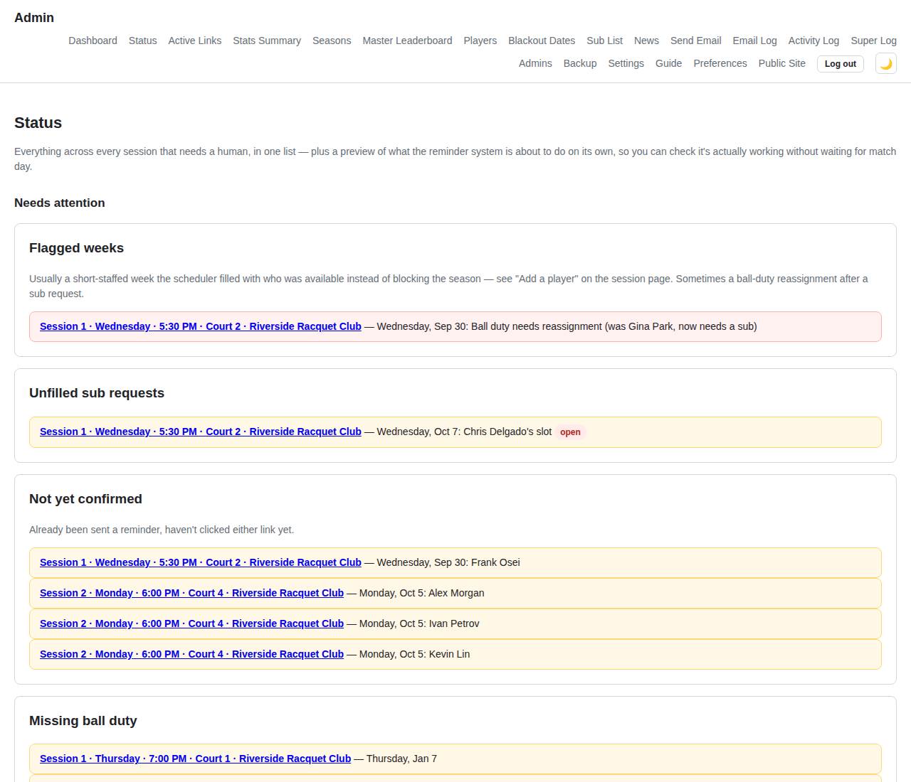

*The Status page: everything that needs a human, across every session.*

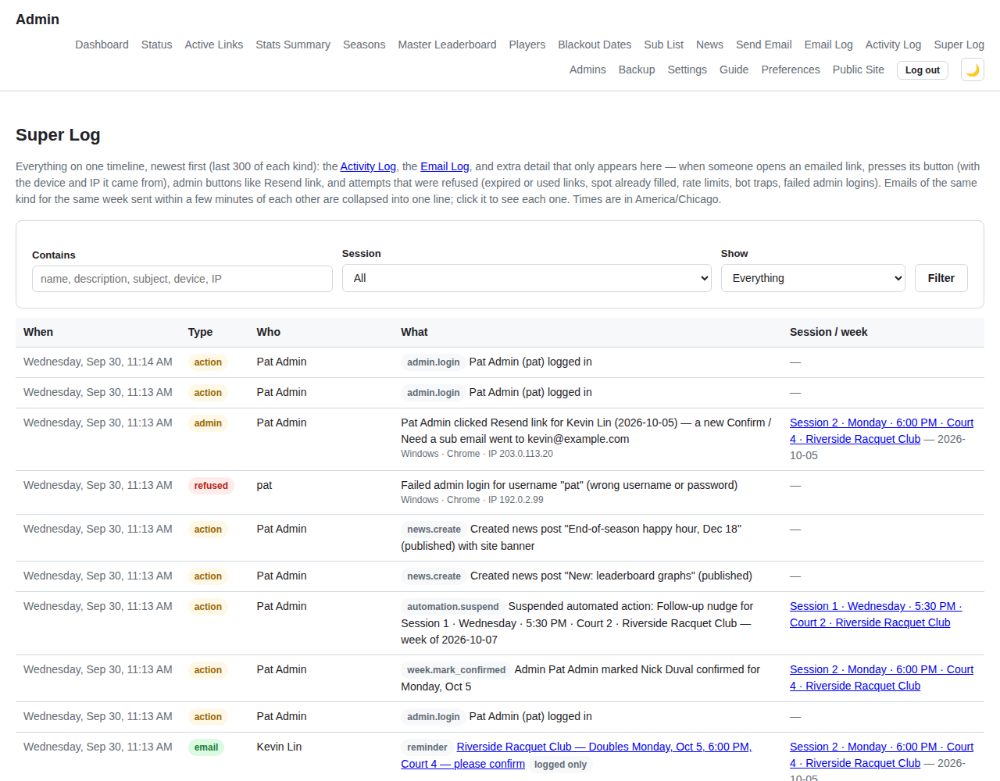

*The Super Log shows who opened or clicked an emailed link, from what device, alongside actions and emails.*

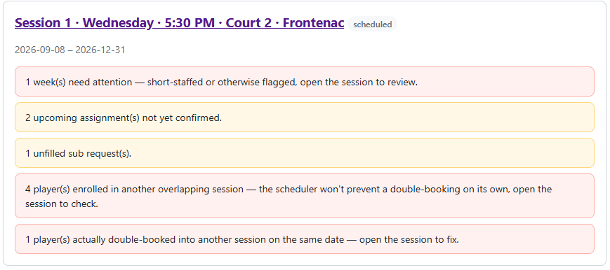

*Every kind of flag a session can show, all on one card. Normally you'll see none of these ("All clear") or just one or two.*

**Stats Summary** is for checking how each active session is going overall: roster size, weeks played, confirmed and unconfirmed counts, open subs, and ball duty problems, with each player's target, games played, and ball duty listed underneath. Each session's own Stats page (linked from its detail page) has the same breakdown plus a partner-pairing grid and sub history, for when you want all the detail on one session.

**Backup** is where you can make a backup or push one off-site whenever you want. Both also run automatically every night. It isn't part of running a session, but it's good to know where it is.

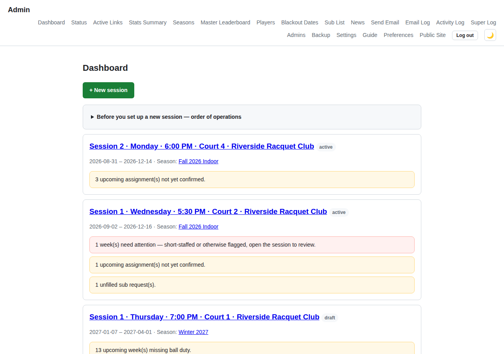

*Each session card on the dashboard shows its own problems. Here, one session has an unfilled sub request, a week that needs attention, and a player who hasn't confirmed. Click into a session to fix it.*

**Active Links** (admin menu) lists every emailed link that still works: sub links, confirm / need-a-sub links, pending swaps, pickup sign-ups, "My Other Dates" edit links and "Edit blackout dates" links. Cancel any of them and that link shows "Link not found" from then on. A cancelled sub link also keeps that person from being emailed about the same spot again if it later goes to the sub list. Every cancel is in the Activity Log as `link.cancel`.

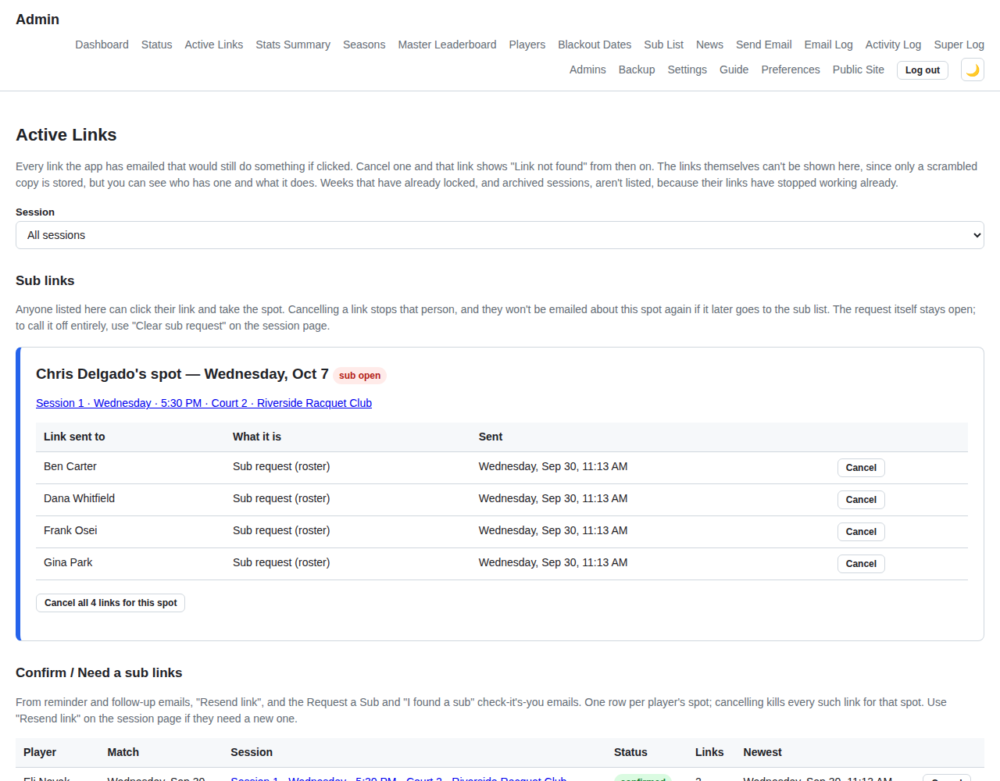

*Cancel any emailed link that should stop working, one at a time or all links for a spot.*

## 8\. Running more than one session at once

You can run several sessions at the same time: different clubs, different courts, or a season split into two halves. If the same player is in two sessions that play on the same day of the week with overlapping dates, you'll get a warning when you save the roster. It's only a warning. The scheduler doesn't prevent it, so check whether the two schedules actually collide once both are made. If a player does end up double-booked, it's flagged everywhere: the session detail page, the dashboard, the Status page, and also on the player's own schedule, PDF, and calendar. That way they can fix it themselves with a sub request or a swap without waiting for you to notice.

Both warnings show up as small tables on the session detail page, so a player flagged on several dates only takes up a row or two. They go away at different times. **Double-booked** clears itself once either week has been played and locked, so it only shows conflicts that are still ahead. **Overlapping enrollment** stays for as long as both sessions are active, even after the shared dates pass, because it's a warning about how the player is enrolled, not about one particular date. Blackout dates apply across sessions (see §3), so once you've decided which session a player should sit out, blacking out that date is often the easiest fix.

The double-booked table has a **Resolve conflicts with …** button for each other session involved. For every double-booking it suggests a week swap inside one session that clears it, moving the player out of whichever session has the lower priority for them. Nothing changes until you make a suggested change yourself or click **Accept all suggested changes**.

## 9\. Weather forecast

Turn it on for a session from its Edit page (§1). There's a checkbox and fields for the latitude and longitude of the courts, with a [latlong.net](https://www.latlong.net/) link right there if you need to look them up. It's off by default, and both coordinates are required. If you check the box and leave either one blank, the save is rejected and nothing changes. Once it's on, players see a small forecast (temperature, conditions, chance of rain) next to each upcoming date on the Season Schedule and Next 4 Weeks pages, and it's included in their reminder email (or the "you're in" email for pickup games). See the player-side [Weather forecast](USER_GUIDE.md#weather) section for what that looks like. You'll also see the forecast next to each week's date on the session detail page.

The forecast comes from OpenWeatherMap's free API. There's one API key for the whole server (`OPENWEATHER_API_KEY` in `.env`; see `.env.example`), and every session uses it. If the checkbox is on but there's no key, nothing shows up, the same as if the checkbox were off. It doesn't show an error.

It updates about once an hour, starting when that week's first email goes out and stopping an hour after the match. To update it right away, or to check that it's working, click **Update weather now** on the week's card (next to Send email to players). That skips both the timing window and the hourly limit. You'll see either the new forecast or an error message, usually a bad API key or OpenWeatherMap being down. Either way, the result is also written to the Activity Log so there's a record of it.

The automatic hourly updates log failures too, but no more than once an hour per session. Otherwise a session with a bad key or bad coordinates would log the same failure every minute and bury everything else in the Activity Log. These entries show up as `weather.refresh_failed` from "System (automatic)," since no admin triggered them. If you see one, fix the key or coordinates and click **Update weather now** to make sure the fix worked.

## 10\. Seasons, leaderboards & news

**Seasons** group sessions that belong together, like a first-half and second-half session on the same court. Each season gets its own leaderboard and graphs built from all of its sessions. From here you can rename a season, hide its stats from players, set the minimum matches for its win % board, leave players out of its board, and archive the whole season at once.

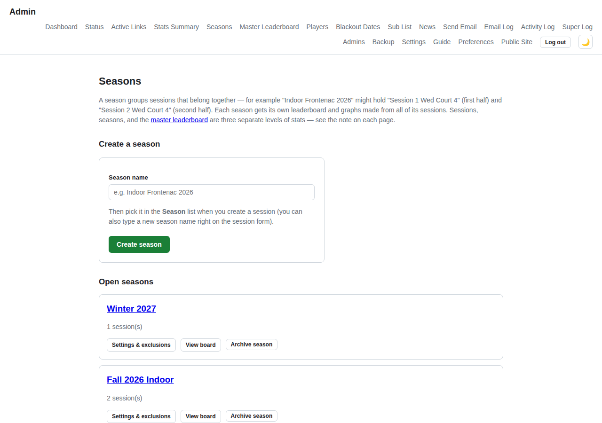

*Every session belongs to a season. Archiving a season archives all of its sessions too.*

When Stats are on for a session, players enter how many games they won after each match. If anyone's score is still missing, that week's ball-duty player gets a reminder (24 hours after the match by default) and a second one later (48 hours by default; set it to 0 to skip it). Both times are on the session's Edit page.

The **Master Leaderboard** combines every session and every player. It keeps counting until you reset it, for example after the indoor season ends. A reset doesn't delete any scores. The master board just starts counting again from that day, and the old standings stay viewable as a past period. You can undo the last reset.

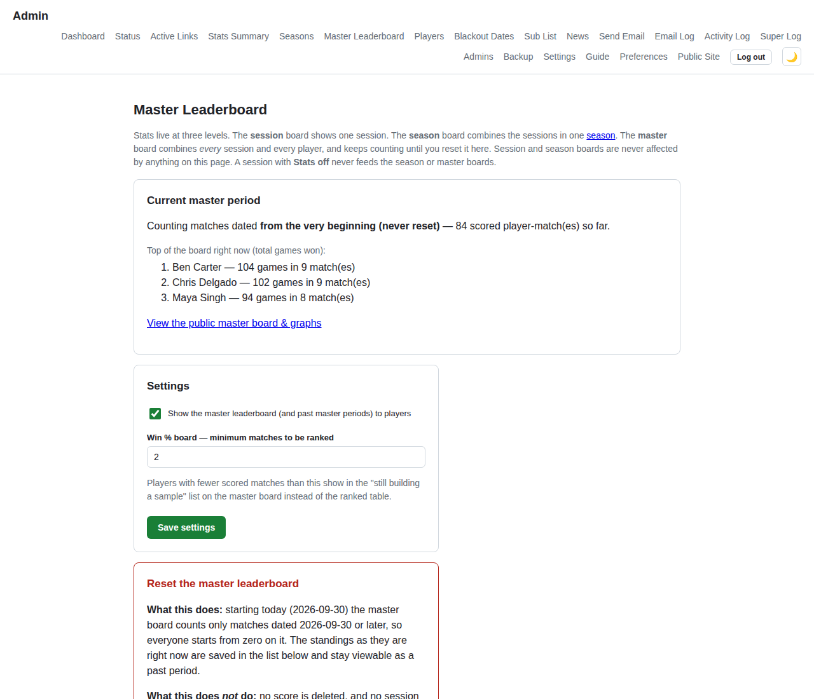

*Type RESET to start a new master period, or UNDO to take the last reset back.*

**News** is a small blog for announcing new features, a happy hour, a court change, anything. Paste or drag screenshots straight into a post. Tick **Show a banner** and a colored strip linking to the post appears across the top of every player page until the end date you set. Players can close it, and it comes back if you edit the post.

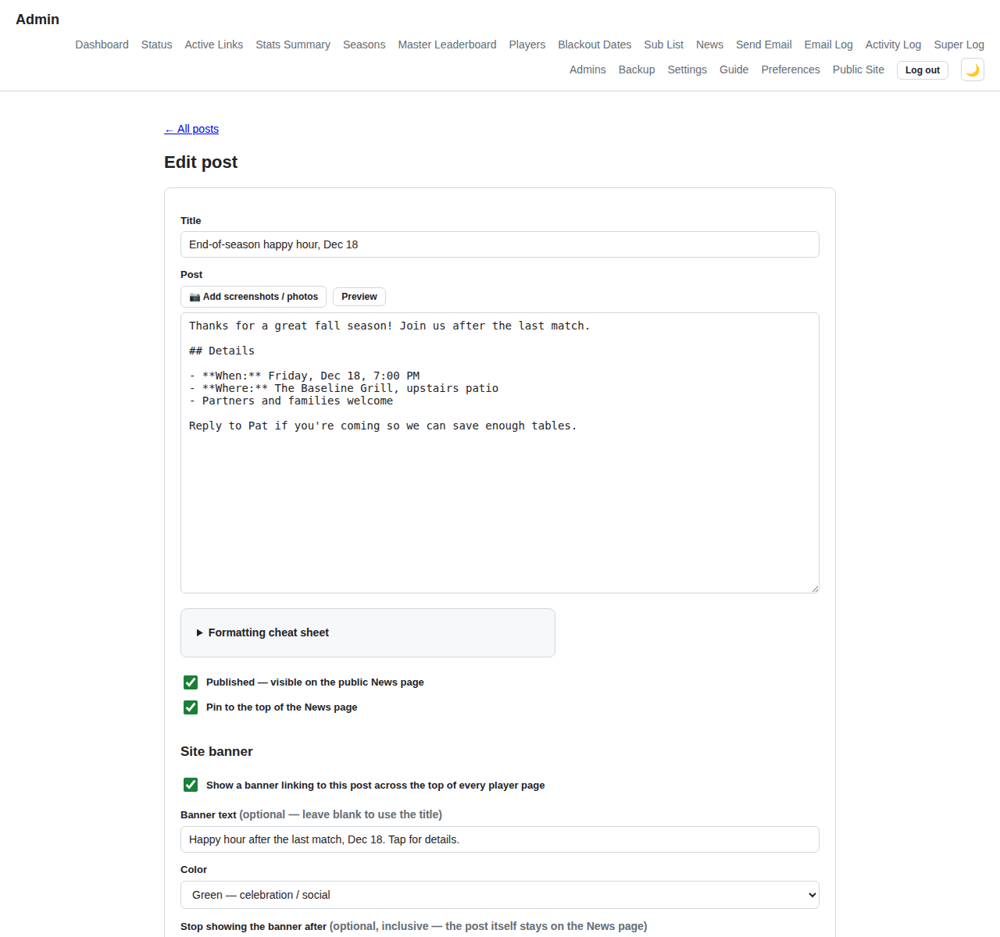

*The banner text, color and end date are set on the post itself.*

## 11\. Wrapping up a session

When a session is over, **Archive** it from the session detail page. That hides it from the dashboard and all player pages and stops any more reminder emails, but it doesn't delete anything. You can unarchive it later if you need to look something up. If a session was only test data, **Delete** it from the Edit page instead. That's permanent, and it asks you to confirm first. Deleting a session never deletes the players, since they're shared with other sessions.

Two pages you'll rarely need: **Admins**, where each admin gets their own username and password (everything they do is logged under their name), and **Settings**, for the time zone every match time is in and the site title shown at the top of every player page.
