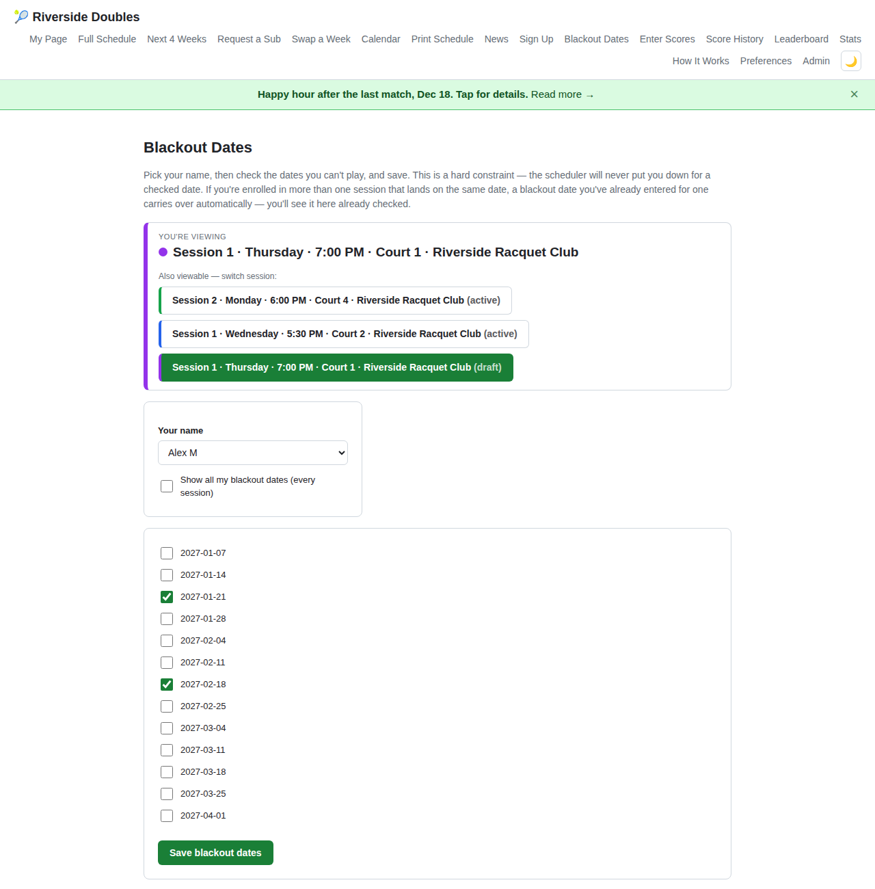
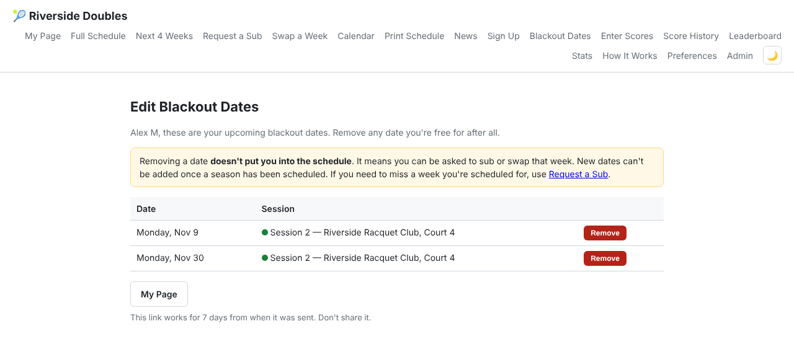
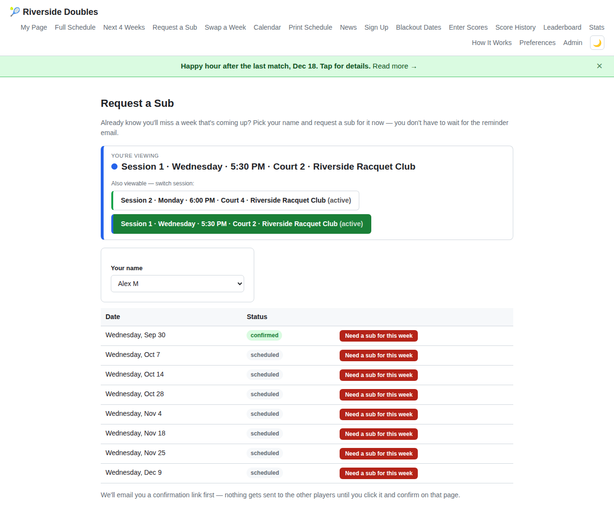
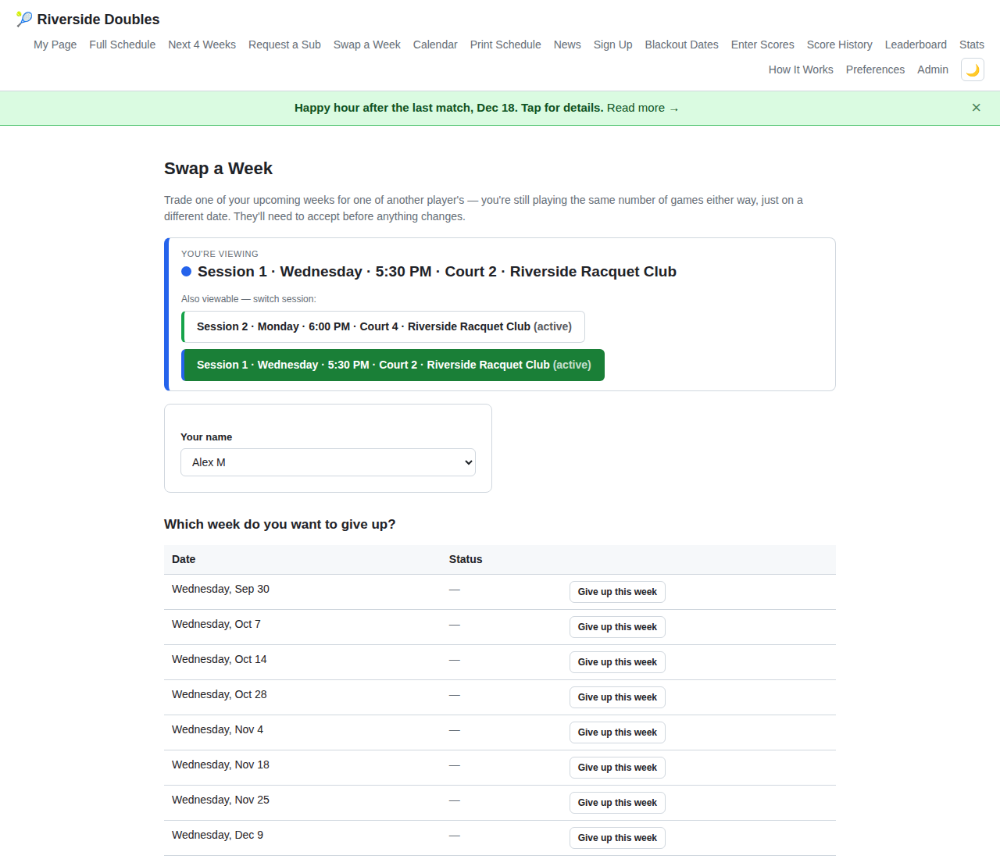
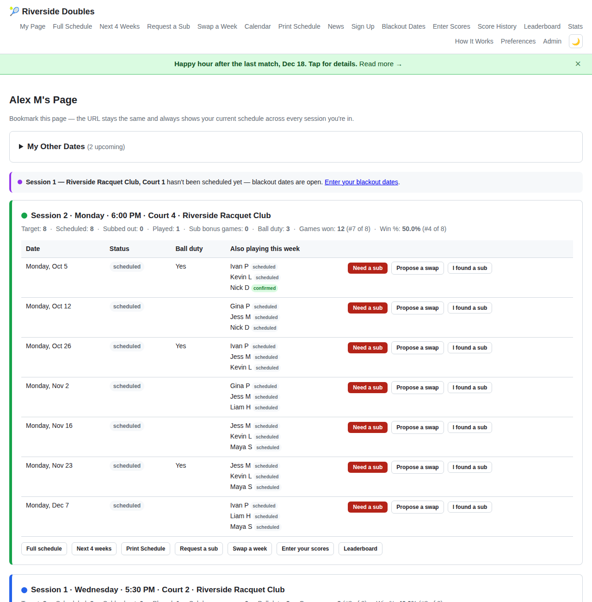
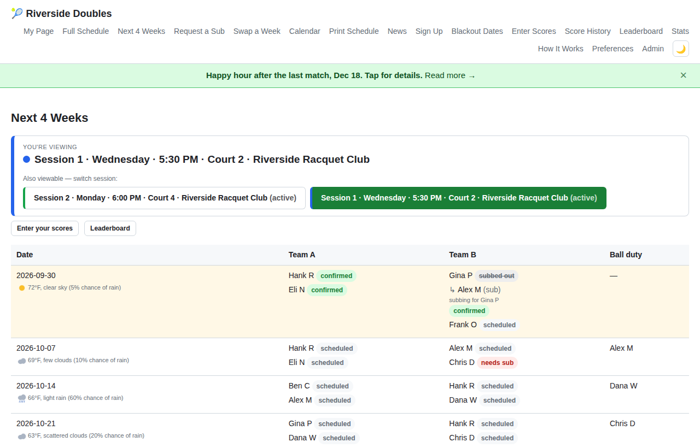
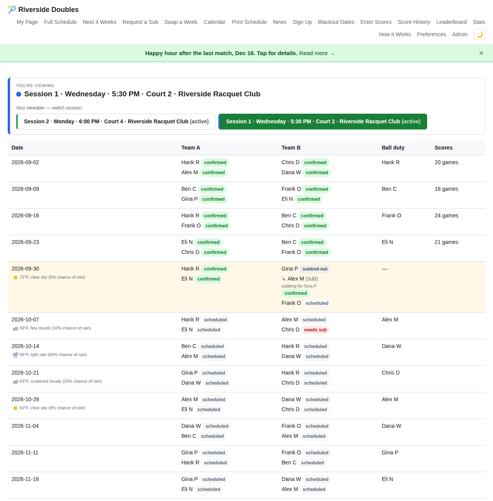
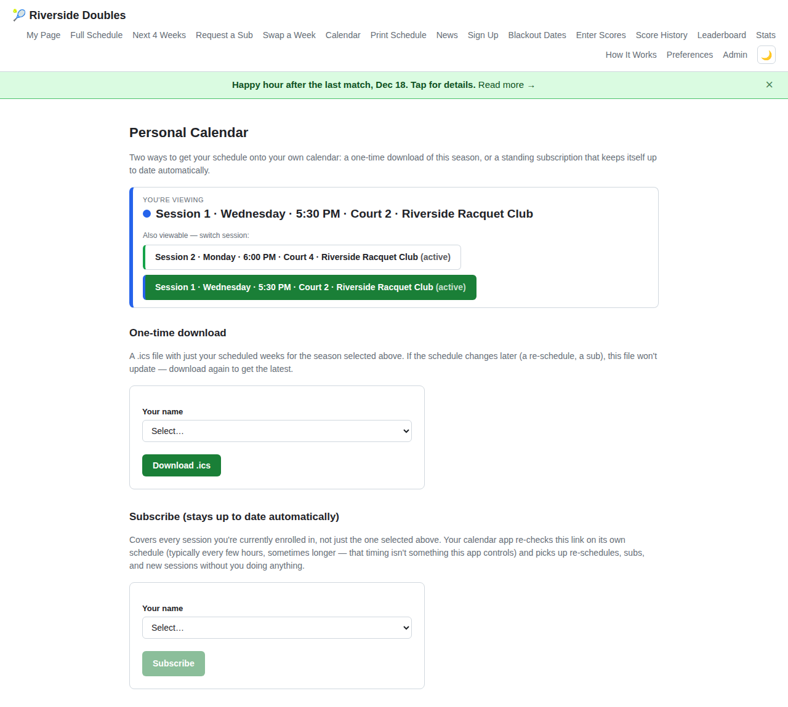
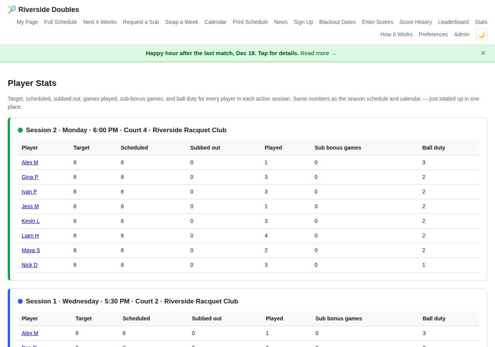
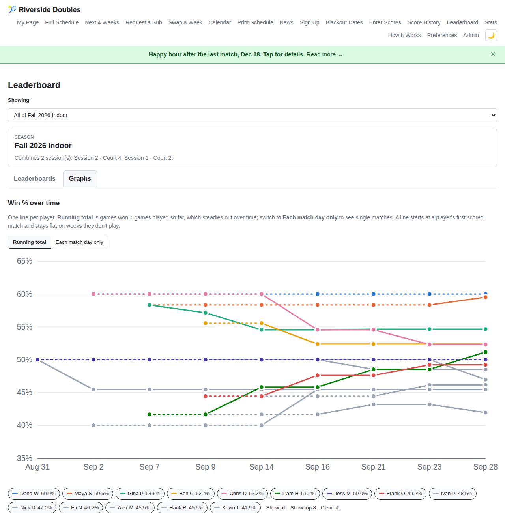

<!-- Generated from the app's /help page by `npm run guides` (src/scripts/write-guides.js). Edit the page, not this file. -->

> This is a copy of the **How It Works (player guide)** page built into the app (/help). Example names, clubs and dates are made up.

# How It Works

A tour of everything on this site. Bookmark it for when you forget where something is. You can do all of this yourself without having to email or call the admin.

**Jump to:**

-   [Signing up for a season](#signup)
-   [Blackout dates](#blackout)
-   [Request a Sub](#request-sub)
-   [I Found a Sub](#found-sub)
-   [Swap a Week](#swap)
-   [The full timeline: what happens, and when](#timing)
-   [My Page](#my-page)
-   [Confirming you're playing](#confirming)
-   [Season Schedule & Next 4 Weeks](#schedule)
-   [Weather forecast](#weather)
-   [Calendar](#calendar)
-   [Print Schedule](#pdf)
-   [Player Stats](#stats)
-   [Scores & Leaderboard](#scores)
-   [Pickup games (ad-hoc sessions)](#adhoc)
-   [What does "double booked" mean?](#double-booked)
-   [What do the badges mean?](#statuses)

## Signing up for a season

Before a new season is scheduled, you may be asked to go to **Sign Up** and say how much you want to play. Pick your name and choose full, half, or quarter time. The page shows how many weeks that works out to for this session, based on the percentages the admin set. You can change your answer until the schedule is made, and your most recent answer is the one that counts. If you don't want a regular spot this time, pick "Sub only" and you'll go on this session's sub list instead of the roster. Not every session uses this page. Some admins still set everyone's games by hand.

When sign-ups open for a new session, you'll get an email with a link that already has your name picked.

## Blackout dates

If you already know there are dates you can't make this season, go to **Blackout Dates**, pick your name, and check off those dates. It saves as soon as you check a box. You can only add dates before the admin makes the schedule. After that, you'd use **Request a Sub** or **Swap a Week** to miss a week instead.

**Free on a date after all?** Once the schedule is made you can still *remove* an upcoming blackout date. Click **Edit dates** next to your blackout dates on [My Page](#my-page) (or on the Blackout Dates page after picking your name). We'll email you a link that works for 7 days, and from there you can remove any upcoming date. Removing a date doesn't add you to the schedule. It just means you can be asked to sub or swap that week. You can't add new dates this way.

If you're in more than one session and they have matches on the same date, you only need to enter that blackout once. It carries over to the other session and shows up there already checked (and greyed out). To see all the blackout dates you've entered in every session, not just this one, check "Show all my blackout dates" under the name dropdown.

When a new session is ready for blackout dates, you'll get an email about it, so you don't have to go looking:

> 📧 *Example email*
> 
> **To: jamie@example.com**  
> **Subject:** Riverside Doubles Club — Enter your blackout dates — Wednesday Doubles, 6:00 PM, Court 2
> 
> ---
> 
> **Wednesday Doubles — Riverside Doubles Club, Court 2 · 6:00 PM, Court 2**
> 
> Hi Jamie Rivera,
> 
> **Wednesday Doubles** is being scheduled. If there are any dates you already know you can't play, let us know before the schedule is generated:
> 
> **[ Enter your blackout dates ]**
> 
> That link will already have your name selected — just check off any dates you can't make. Nothing else to do if you don't have any — you'll be assumed available every week.
> 
> This only works until the schedule is generated — after that, use Request a Sub instead for any date you end up needing to miss.
> 
> Riverside Doubles Club — Court 2
> 
> Full schedule: https://your-site/schedule

The button brings you here with your name already picked:

*Pick your name, check the dates you can't make, and save. That's all there is to it.*

*The page the "Edit dates" email opens. You can remove dates here, but not add them.*

## Request a Sub

If you know ahead of time that you'll miss a match, go to **Request a Sub**, pick your name, and click "Need a sub for this week" next to the date. You don't have to wait for the reminder email.

Because this page has no login, clicking the button doesn't email anyone yet. First you'll get an email asking you to confirm it was you. Once you click the link in that email, everyone who isn't already playing that week gets asked to fill in, and the first one to answer gets the spot. Your confirmation email also tells you who was asked, when it goes to the sub list if nobody takes it, and what to do if nobody ever does, so you don't have to keep checking back. If you see a red "double booked" badge next to a date, that's usually the one to request a sub for (more on that below).

Here's the email everyone else on the roster gets:

> 📧 *Example email*
> 
> **To: dan@example.com**  
> **Subject:** Riverside Doubles Club — Sub needed — Wednesday, Sep 2, 6:00 PM, Court 2 doubles
> 
> ---
> 
> **Wednesday Doubles — Riverside Doubles Club, Court 2 · Wednesday, Sep 2 · 6:00 PM, Court 2**
> 
> Hi Dan Ostrow,
> 
> Jamie Rivera needs a sub for **Wednesday, Sep 2** at 6:00 PM. First to confirm gets the spot.
> 
> **[ I'll play ]**
> 
> **Can't play? No need to reply** — just ignore this email. Replies aren't read by the scheduler, so the button above is the only way to take the spot.
> 
> **Playing that week:** Alice Chen, Marcus Lee, Priya Nair  
> **Bringing balls:** Alice Chen
> 
> Riverside Doubles Club — Court 2
> 
> Full schedule: https://your-site/schedule

*A red `double booked` badge next to a date usually means that's the week to get a sub for.*

After you request a sub, the button for that week is replaced with a note saying the request is out. When someone takes it, the week shows `subbed out`. You don't need to do anything with either one. They're just there so you can see it went through.

## I Found a Sub

Sometimes you've already found your own replacement before the app asks, like a friend or someone from another session. When that happens, don't ignore the reminder, and don't use the regular Request a Sub either, since that asks the whole roster. Instead, use the "Already found your own sub for this week?" link at the bottom of your reminder or follow-up email, or the "I found a sub" button on **My Page** (next to Need a sub and Propose a swap).

If you start from My Page, you'll get a quick email to confirm it's you first. If you clicked from a reminder email, you skip that step, since the link already proves who you are. Then pick the person you lined up from the list of everyone on the roster and sub list. If they're new to the app, type in their name and email instead.

That person gets an email saying you asked them to cover your spot. They click the button in it, then click once more on the page it opens to accept. As soon as they accept, they're confirmed for that week, your spot shows "subbed out," and everyone playing that week (plus you) gets an email saying who's subbing for you. Nobody else is asked while they have time to answer. If they haven't accepted a few hours after you named them (4 by default), you both get a reminder. If they still haven't accepted a few hours before the match (4 by default), your spot opens up to the rest of the roster and the sub list, and you'll get a warning an hour before that happens. If you know they're playing, contact your admin before then and they can confirm it for them. Your confirmation email lists the exact times. If you name someone very close to the match, the app doesn't follow up at all and lets the admin know instead. Someone new gets added to the sub list automatically, which makes it easier next time. The admin gets a notice and can tidy up their name or link afterward if needed.

## Swap a Week

If you'd rather trade with one specific person than open it up to everyone, go to **Swap a Week**, pick your name, and choose the week you want to give up. Then pick who you want to swap with and which of their weeks you'd take. Because this page has no login, the other player isn't emailed right away. You'll get an email first, and the proposal only goes to them after you click the link in it. Nothing changes unless they accept. You both still play the same number of games, just on different dates, so neither of you counts as a sub.

Here's what the other player gets:

> 📧 *Example email*
> 
> **To: alice@example.com**  
> **Subject:** Riverside Doubles Club — Jamie Rivera wants to swap weeks with you — Wednesday Doubles, 6:00 PM, Court 2
> 
> ---
> 
> **Wednesday Doubles — Riverside Doubles Club, Court 2 · 6:00 PM, Court 2**
> 
> Hi Alice Chen,
> 
> Jamie Rivera would like to swap with you in **Wednesday Doubles**:
> 
> -   You'd give up **Wednesday, Sep 9**
> -   You'd take over **Wednesday, Sep 2** (currently Jamie's)
> 
> You're still playing the same number of games either way — just trading which week.
> 
> **[ Review and respond ]**
> 
> Riverside Doubles Club — Court 2
> 
> Full schedule: https://your-site/schedule

*First, pick which of your weeks you're giving up. On the next page you choose who to swap with.*

## The full timeline: what happens, and when

The sections above cover each page by itself. This one puts it all together: when each automatic email goes out, and what happens if you don't respond. There's one flow each for confirming, requesting a sub, and swapping.

### Confirming you're playing

> *2 days before your match (the admin can change this)*
> 
> **Reminder email sent**
> 
> It has Confirm and Need a sub buttons. You get one per week.

↓

> *About 27 hours before match time (the admin can change this)*
> 
> **No answer yet? One follow-up**
> 
> Same two buttons. You only get it if you haven't confirmed or asked for a sub yet. It's timed to show up the day before instead of the morning of, so for an evening match it usually arrives during the workday.

↓

- **If: You click Confirm**
  
  > **You're confirmed**
  > 
  > Nothing else to do.
- **If: You click Need a sub**
  
  > **Goes to Request a Sub**
  > 
  > See that flow below. An email goes out to the rest of the roster.
- **If: You click "Already found your own sub?"**
  
  > **Pick who you lined up**
  > 
  > The whole roster isn't emailed, only the one person you pick. See [I Found a Sub](#found-sub) above.
- **If: You do nothing**
  
  ↓
  
  > *Match time arrives*
  > 
  > **Nothing else happens automatically**
  > 
  > Unlike a sub request, there's no further reminder or escalation. Those two emails are all you get. Your status stays "scheduled," the week locks, and both links stop working. The admin sees an "unconfirmed" flag on their dashboard, and what happens next is up to them.

### Request a Sub

- **If: From a reminder email**
  
  > **Click "Need a sub"**
  > 
  > The link already proves it's you, so you go straight to the confirm page below.
- **If: From the Request a Sub page**
  
  > **Pick your week (no link yet)**
  > 
  > You'll get an email to confirm it's you first. Nobody else is emailed until you click the link in it. That keeps anyone else from requesting a sub in your name.

↓

> **"Are you sure?"**
> 
> One more click. After this, the rest of the roster gets emailed right away, so make sure it's the right week.

↓

> **Everyone not already playing that week gets an email**
> 
> Except anyone who has that date blacked out. The first person to click "I'll play" gets the spot.

*Note:* An admin can also mark your spot as needing a sub without you asking. From there it works the same way, except the email to the roster waits until that week's normal reminder time instead of going out right away.

↓

- **If: Someone takes it**
  
  > **Spot filled**
  > 
  > You're marked subbed out and get an email saying you're all set. The new player is confirmed, and everyone else playing that week gets a heads-up.
- **If: Nobody takes it yet**
  
  ↓
  
  > *24 hours before the match (the admin can change this)*
  > 
  > **Goes to the sub list**
  > 
  > A separate group of subs, managed by the admin, gets an email too. If the session doesn't have any subs assigned, this step is skipped.
  
  ↓
  
  - **If: A sub takes it**
    
    > **Spot filled**
    > 
    > Same as above.
  - **If: Still nobody**
    
    ↓
    
    > *4 hours before the match (the admin can change this)*
    > 
    > **You get a "still open" email**
    > 
    > It tells you nobody has taken your spot yet and to contact your admin for help. The admin gets one too. If there's nobody left to ask before then, this comes right away.
    
    ↓
    
    > *Match time arrives*
    > 
    > **Marked unfilled**
    > 
    > The admin gets a flag, and it's their call from there. They can add someone by hand, or the week plays one short.

*Note:* An admin can close this out at any point. They can reassign the spot, mark you confirmed after all, or cancel the request if you picked the wrong week by mistake. Canceling puts you back to "scheduled," and you'll get the normal reminder.

### Swap a Week

> **You propose a trade**
> 
> Pick one of your upcoming weeks, a teammate, and one of their weeks you'd rather play. Since this page has no login, nothing is sent to them yet.

↓

> **Confirm it's you**
> 
> You get an email first. The other player isn't contacted until you click the link in it, which keeps anyone else from proposing swaps in your name.

↓

> **They get an email to accept or decline**
> 
> Nothing changes until they answer. You'll get an email letting you know the proposal was sent.

↓

- **If: They accept**
  
  > **Swap done**
  > 
  > You trade spots, you're both confirmed, and everyone else playing in those two weeks gets a heads-up.
- **If: They decline**
  
  > **Nothing changes**
  > 
  > You get an email. You keep your original week.
- **If: They haven't answered**
  
  ↓
  
  > *48 hours before the earlier of the two dates*
  > 
  > **One reminder email**
  > 
  > It only goes to them. You already know you're waiting.
  
  ↓
  
  - **If: They answer**
    
    > **Accept or decline**
    > 
    > Same as above.
  - **If: Still nothing**
    
    ↓
    
    > *The earlier match date arrives*
    > 
    > **Proposal expires**
    > 
    > That week is about to lock, so the swap can't happen anymore. No email is sent. It just closes, and you're free to swap those weeks with someone else.

*Note:* An admin can cancel a pending swap. If an admin reassigns either spot while a swap is pending, the swap gets canceled automatically.

## My Page

This is the quickest way to see everything. Go to **My Page**, pick your name, and bookmark the page (or add it to your phone's home screen). It always shows your current schedule for every session you're in, and you won't have to pick your name again. Each upcoming match has buttons to request a sub or propose a swap, and your calendar link is here too. Each session's card also shows your target, games played, and ball duty count for that session. If one of your blackout dates falls on one of that session's match dates, there's a note above the card with the date, and an **Edit dates** button for removing a date you no longer need (see [Blackout dates](#blackout)).

**My Other Dates.** At the top of My Page there's a collapsible "My Other Dates" section. If you play somewhere else too (another league, a club match, a pickup game), you can add those dates there and they'll show up in your [calendar](#calendar) right next to your league matches, so everything you play is in one place. To keep anyone else from changing your calendar, click *Email me a link to add dates*. We'll email you a link that works for 30 days, and you can add or delete dates from it. These dates are only for your calendar. They don't change your league schedule or your blackout dates.

*In more than one session? Each one gets its own card here, in the same color that session uses everywhere else on the site.*

## Confirming you're playing

A couple of days before each match, you'll get a reminder email with two buttons: one to confirm you're playing, and one to say you need a sub. Just opening the email doesn't do anything. You have to click a button on the page it opens. If you don't respond, you'll get one more reminder about a day before the match. After match time, both links stop working and the week is locked.

Here's what the email looks like:

> 📧 *Example email*
> 
> **To: jamie@example.com**  
> **Subject:** Riverside Doubles Club — Doubles Wednesday, Sep 2, 6:00 PM, Court 2 — please confirm
> 
> ---
> 
> **Wednesday Doubles — Riverside Doubles Club, Court 2 · Wednesday, Sep 2 · 6:00 PM, Court 2**
> 
> Hi Jamie Rivera,
> 
> You're scheduled to play doubles on **Wednesday, Sep 2** at 6:00 PM.
> 
> **[ Confirm you're playing ]** **[ Need a sub? Click here ]**
> 
> **You're on ball duty this week** — please bring the balls.
> 
> 
> 
>  **Forecast for match time:** 74°F, clear sky (5% chance of rain)
> 
> **Next few weeks:**
> 
> -   Wednesday, Sep 9 — Alice Chen, Marcus Lee, Priya Nair, Dan Ostrow
> -   Wednesday, Sep 16 — Alice Chen, Marcus Lee, Priya Nair, Jamie Rivera (ball duty: Priya Nair)
> 
> Riverside Doubles Club — Court 2
> 
> Full schedule: https://your-site/schedule

The forecast line only shows up if your admin turned on weather for this session. See [Weather forecast](#weather) below.

## Season Schedule & Next 4 Weeks

**Season Schedule** shows the whole season: every date, who's playing, the teams, and who has ball duty. **Next 4 Weeks** is the same table, but only the next four dates.

*Team A and Team B for each date, and who's bringing the balls.*

## Weather forecast

If your admin turned it on for a session, you'll see a small forecast (temperature, conditions, and chance of rain) next to each upcoming date on the Season Schedule and Next 4 Weeks pages. It's also in your reminder email, or in the "you're in" email for a pickup game. The forecast updates about once an hour, starting when the first email for that week goes out and stopping an hour after the match, so what you see that morning is pretty current. If you don't see a forecast next to a date, weather isn't turned on for that session, or the admin hasn't entered a location for it yet.

*The forecast sits right under its date. You don't have to click anything to see it.*

## Calendar

Go to **Calendar** to put your matches on your phone or computer. There are two options. You can download the current season once, or you can **Subscribe**, which keeps your calendar updated as the schedule changes. Subscribing is the better choice if you don't want to think about it again. Any "My Other Dates" entries you've added on [My Page](#my-page) are included too. The subscription gets all of them, and the download gets the ones that fall within that season.

*Subscribe once, and schedule changes, subs, and swaps show up on their own. No need to come back and download it again.*

## Print Schedule

**Print Schedule** gives you the whole season on one page, which is handy for the fridge or for handing out. If more than one session is running, there's also a "Download All Active Sessions" option that puts every session in one PDF, sorted by date. It's a couple of pages instead of one, but it makes it easier to see everything happening in a given week.

## Player Stats

Go to **Stats** to see how the season is going for every active session. Each session has a table showing every player's target games, games played so far, extra games from subbing for someone else, and how many times they've had ball duty. Click any name to go to that player's **My Page**.

*The same numbers you'd get by counting from the schedule, already added up for you.*

## Scores & Leaderboard

If your admin turned this on for a session, you can enter the score after a match. Once a match starts, the **Full Schedule** shows an **Enter scores** button in that week's Scores column (or go to **Enter Scores** in the menu). A day after the match, the button changes to the match's total games played. If nobody's entered anything after two days, it says **Scores needed**, and you can still click it to fill them in. You'll see a form for the whole court: one "total games played" number that everyone shares, plus a "games won" box for each player. That way one person can fill in the whole thing instead of everybody entering their own. If you'd rather just enter yours, use the lookup link on **Enter Scores** to get to your own page. Each game won counts as 1. If you played a 7- or 10-point tiebreaker, whoever won it gets 1, the same as a regular game. Anyone can fix a score for 24 hours after it's entered. After that, only the admin can change it.

Scores feed the **Leaderboard**, which has two boards for each session. One is total games won. The other is win percentage (games won divided by games played), so someone who's played every week doesn't automatically rank above someone who's missed a few but wins more of the games they do play. There's also an all-time version of each that covers every session you've played in.

There's one catch with the win % board. You only get ranked after you've entered scores for a minimum number of matches (your admin sets this for each session, and it's small by default). Otherwise one great night early in the season could put someone ahead of a person with a whole season of good results. If you're not in the ranked table yet, look at the "still building a sample" list below it. Your numbers are there, just not ranked yet.

At the top of the Leaderboard page you can pick one of three levels: a single **session**, a **season** (a group of sessions the admin named, like "Indoor 2026"), or the **Master** board, which covers everything since the admin last reset it. Each one has a Leaderboard tab and a Graphs tab showing win % by week and average games per match. Sessions with stats turned off don't show up or count anywhere.

*The Graphs tab: win % over the season, one line per player. A dotted line means that player hasn't played the minimum matches yet.*

## Pickup games (ad-hoc sessions)

Some sessions are pickup games instead of a set season schedule. They fill up week by week, first come, first served. Most of this page doesn't apply to them: there's no season roster, no target games, no blackout dates, and no confirm or need-a-sub emails. Signing up *is* how you confirm.

An invite goes out a couple of days before each game. The first 4 people to sign up get the first court, the next 4 get a second court, and so on, with no limit on courts. Spots aren't held for anyone, so sign up early.

Here's the invite:

> 📧 *Example email*
> 
> **To: dan@example.com**  
> **Subject:** Riverside Doubles Club — Pickup game Thursday, Sep 4, 6:00 PM, Court 4 — want in?
> 
> ---
> 
> **Thursday Pickup — Riverside Doubles Club, Court 4 · Thursday, Sep 4 · 6:00 PM, Court 4**
> 
> Hi Dan Ostrow,
> 
> Looking for players for **Thursday, Sep 4** at 6:00 PM. First come, first served — the first 4 to sign up get the first court, the next 4 get a second court, and so on.
> 
> **[ I'm in ]**
> 
> If you're not free this time, no need to do anything — you'll get invited again for the next one.
> 
> Riverside Doubles Club — Court 4
> 
> Full schedule: https://your-site/schedule

If the sign-ups don't come out to a multiple of 4 as the game gets close, people who haven't signed up yet may get one short reminder. About a day before the game it's settled, and you'll get one of two emails. If you're on a court, you'll get one telling you who you're playing with:

> 📧 *Example email*
> 
> **To: dan@example.com**  
> **Subject:** Riverside Doubles Club — You're in — Thursday, Sep 4, 6:00 PM, Court 4
> 
> ---
> 
> **Thursday Pickup — Riverside Doubles Club, Court 4 · Thursday, Sep 4 · 6:00 PM, Court 4**
> 
> Hi Dan Ostrow,
> 
> You're set for **Thursday, Sep 4** at 6:00 PM, Court 4.
> 
> **Playing with:** Alice Chen, Marcus Lee, Priya Nair
> 
> 
> 
>  **Forecast for match time:** 74°F, few clouds (10% chance of rain)
> 
> Riverside Doubles Club — Court 4
> 
> Full schedule: https://your-site/schedule

If your group didn't get to 4, you'll get a short note saying this one didn't come together. Either way, you don't need to do anything, and you'll be invited to the next one. (The forecast line only shows up if your admin turned on weather for this session. See [Weather forecast](#weather).)

Here's the whole thing in one picture:

> *About 56 hours before the game (the admin can change this)*
> 
> **Invite email goes to everyone on the roster**
> 
> Each person gets an "I'm in" link. It's first come, first served. As soon as 4 people sign up, that's a court. There's no deadline to wait for.

↓

> **Sign-ups come in**
> 
> Each group of 4, in the order they signed up, gets its own court. There's no limit on courts.

↓

- **If: Sign-ups come out to a multiple of 4**
  
  > **No reminder needed**
  > 
  > All the courts are full.
- **If: 1 to 3 people are left over**
  
  ↓
  
  > *About 30 hours before the game (the admin can change this)*
  > 
  > **One reminder, only to people who haven't signed up**
  > 
  > Nobody who's already on a full court gets it.

↓

> *About 24 hours before the game (the admin can change this)*
> 
> **Courts are set**
> 
> Whoever is signed up at this point is locked in. This is also your only confirmation. There isn't a separate confirm step.

↓

- **If: You're on a full court**
  
  > **"You're in" email**
  > 
  > Tells you your teammates and court.
- **If: Your group didn't get to 4**
  
  > **"Not enough signed up" email**
  > 
  > This one isn't happening. You don't need to do anything, and you'll be invited to the next one.

*Note:* Once you've signed up for a pickup game, you can't back out on your own. If your plans change, contact your admin. They can add or remove people for a pickup week.

## What does "double booked" mean?

If you're in two sessions that both have a match on the same date, you'll see a red `double booked` badge instead of your normal status everywhere your schedule shows up: the season schedule, My Page, Request a Sub, Swap a Week, the printable schedule, and even the calendar invite. It won't go away on its own. Decide which one you're playing, then request a sub or propose a swap for the other one. Try to do this weeks ahead instead of the week of. Once a sub has been requested for that spot, the badge changes to `needs sub`, since that's the more useful thing to know at that point.

## What do the badges mean?

| Badge | Meaning |
| --- | --- |
| `scheduled` | You're playing this week, but you haven't confirmed yet (and haven't been asked to). |
| `confirmed` | You've confirmed you're playing. |
| `needs sub` | Someone asked for a sub for this spot and nobody has taken it yet. |
| `subbed out` | Someone else took this spot, so you're not playing this week. |
| `double booked` | You're scheduled in two different sessions on the same date. See above. |
